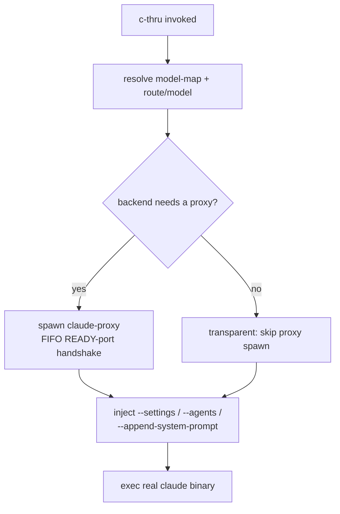

# CLAUDE.md

This file provides guidance to Claude Code (claude.ai/code) when working with code in this repository.

## Wiki
WIKI: /wiki-load <search> or browse wiki/index.md before answering project-domain questions. /wiki-query for synthesis.

## Model rewriting: proxy-only

Model-field rewriting (logical → concrete, route aliasing, fallback
remap) is the proxy's responsibility — see `wiki/entities/declared-rewrites.md`.
Claude Code hooks may observe (log, inject context) or gate (refuse to
proceed) but must not modify `tool_input.model` or `body.model`. A second
rewriting path creates a silent source of drift from `config/model-map.json`.

## What This Repo Is

**c-thru** is the router/proxy layer that lets Claude Code talk to alternative model providers (Ollama, OpenRouter, Bedrock, Vertex, LiteLLM) without changing the vendor CLI. It was extracted from `claude-craft` as a standalone public repo.

## Install and Verify

> **Note:** `/schedule-plan-tasks` (used by the plan-scheduler agent) requires the planning-suite plugin.
> Install separately: `claude /plugin install planning-suite@claude-craft`

```sh
./install.sh                            # symlinks tools into ~/.claude/tools/, seeds model-map
bash -n tools/c-thru             # bash syntax check
node --check tools/claude-proxy         # node syntax check
node --check tools/model-map-*.js tools/llm-capabilities-mcp.js
node tools/model-map-validate.js config/model-map.json   # validate shipped config
node test/model-map-v12-adapter.test.js                  # adapter regression test
bash test/c-thru-bootstrap-auth-env.test.sh              # interactive auth bootstrap (TTY-mocked)
~/.claude/tools/c-thru list      # runtime smoke-test (requires install; --list also accepted)
make test-fast          # run proxy + model-map test suite (~2 min)
make test               # full suite including smoke tests
```

## Concurrent sessions

Multiple Claude sessions may share this working tree. Stage **explicit paths only** — never `git add -A`/`-u`/`.` or other broad adds (they silently stage another session's uncommitted WIP; a past session needed a soft-reset salvage after exactly this).
Proxy e2e/smoke suites are port- and Ollama-contended: `make test-fast` is safe to run concurrently (unit proxy tests use random free ports), but full `test/run-all.sh` runs need exclusivity — full runs take an mkdir-lock for the whole run (proxy-e2e cross-fails on Ollama contention, observed empirically), so a second full run queues instead of cross-failing.

## Directory Layout and Path Invariants

The `tools/` + `config/` two-directory structure is **required**. `c-thru` and `claude-proxy` both compute `ROUTER_REPO_ROOT` as `$(dirname $0)/..` and read `$ROUTER_REPO_ROOT/config/model-map.json`. Do not flatten.

```
tools/
  c-thru                 # bash, 2300+ lines — the entrypoint
  claude-proxy            # node, stdlib-only — Anthropic→provider translation layer
  model-map-layered.js    # merges 3-tier config stack; no external deps
  model-map-validate.js   # schema validator; called by router at startup
  model-map-sync.js       # pulls capability data into the map; calls layered.js
  model-map-edit.js       # interactive map editor; calls validate + layered
  llm-capabilities-mcp.js # MCP server exposing list_models + classify_intent tools
  verify-llm-capabilities-mcp.sh  # shell smoke-test for the MCP server
  verify-lmstudio-ollama-compat.sh # spike: run when LM Studio available to confirm kind:"ollama" vs kind:"openai"
  c-thru-session-start.sh # SessionStart hook — proxy+Ollama health check, silent on happy path
  c-thru-postcompact-context.sh # PreCompact hook — re-inject routing context before Claude Code compresses history
  c-thru-proxy-health.sh  # UserPromptSubmit hook — warns on stderr (exit 0, fail-open) on proxy down
  c-thru-map-changed.sh   # FileChanged/PostToolUse hook — validates model-map.json on edit
  c-thru-classify.sh      # UserPromptSubmit hook — fetches a static /hooks/context block (no classify_intent; proxy ignores prompt content)
  c-thru-ollama-gc.sh     # GC tool — tracks c-thru-pulled Ollama tags; sweeps unreferenced ones. Subcommands: init|record|sweep|purge
  c-thru-self-update.sh   # startup self-update: best-effort git ff-merge with 1s grace; opt-out via C_THRU_NO_UPDATE=1
  hw-profile.js             # shared 5-tier hardware detection (tierForGb); used by router and proxy
config/
  model-map.json          # shipped defaults (standard JSON — no comments; parsed with JSON.parse)
test/
  model-map-v12-adapter.test.js  # adapter fixture test; run with: node test/model-map-v12-adapter.test.js
```

### User Profile Files (`~/.claude/`)

| File | Owner | Lifecycle |
|---|---|---|
| `model-map.system.json` | `install.sh` | Overwritten on every install — verbatim copy of `config/model-map.json`. Never edit manually. |
| `model-map.overrides.json` | user | Created empty `{}` on first install. Never touched on upgrade. Edit here to customize over system defaults. |
| `model-map.json` | derived | Effective merged result (system + overrides). Rewritten by router/proxy on startup. |

## Architecture

For the full per-endpoint × per-backend coverage matrix (which Anthropic
endpoints translate, passthrough, or 501 on each backend, plus
content-block / server-tool sub-matrices), see
`docs/anthropic-api-coverage.md`.

### Request flow

<!-- BEGIN shared-diagram:launch-flow -->

<!-- END shared-diagram:launch-flow -->

Every backend (Anthropic, OpenRouter, Ollama) always routes through the spawned proxy unless
`CLAUDE_PROXY_BYPASS=1` is set — the proxy passes real-Anthropic/OpenRouter/modern-Ollama
requests through to `/v1/messages` near-verbatim (`forwardAnthropic`) and only does a legacy
`/api/chat` translation for backends explicitly marked `format:"ollama-legacy"`
(`forwardOllamaLegacy`). Ephemeral injection on exec:
  - `ANTHROPIC_BASE_URL=http://127.0.0.1:<proxy_port>`
  - `ANTHROPIC_AUTH_TOKEN="ollama"` (for local/spoofed backends)
  - `--settings <inline json>` (injects hooks & llm-capabilities MCP)
  - `--agents <json>` (injects all agents from agents/*.md)
  - `--append-system-prompt "..."` (injects fleet awareness)

Full flow with every branch: [docs/architecture-diagrams.md § 1](docs/architecture-diagrams.md#1-cli-launch--proxy-spawn--claude-exec).
Wire-translation dispatch detail: [docs/architecture-diagrams.md § 3](docs/architecture-diagrams.md#3-wire-translation-dispatch-v1messages).

### Ollama backend wire format

For endpoints with `format: "anthropic"` and a localhost URL (local Ollama), the proxy POSTs to `<endpoint.url>/v1/messages` (Ollama's Anthropic-format adapter, available since Ollama 0.4) with the client's body forwarded **verbatim** except for the resolved `model` field. `tool_use`, `tool_result`, and `thinking` content blocks roundtrip natively — no flattening, no translation. Auth is set to `"none"` so an ambient real Anthropic key in the client environment can never leak to a local backend.

**Legacy escape hatch.** Backends without `/v1/messages` (Ollama < 0.4, LM Studio's Ollama-compat shim) opt into the older Anthropic→`/api/chat` translation path with `legacy_ollama_chat: true` (or `format: "ollama-legacy"`) on the endpoint entry. The legacy path still runs `flattenMessagesForOllama`, which strips non-text content blocks — multi-turn tool conversations don't roundtrip cleanly through it. Use only when `/v1/messages` is genuinely unavailable.

```json
{
  "endpoints": {
    "ollama_local":  { "format": "anthropic", "url": "http://localhost:11434", "auth": "none" },
    "lm_studio":     { "format": "anthropic", "url": "http://localhost:1234",  "auth": "none", "legacy_ollama_chat": true }
  }
}
```

### model-map.json schema

Top-level keys: `endpoints` (or legacy `backends`), `routes`, `models` (models is sparse — most resolution is done via endpoints + routes).
- `endpoints`: connection metadata (format, url, auth). `format` defaults to `"anthropic"` when absent; valid values: `"anthropic"`, `"openai"`, `"ollama-legacy"`. Legacy `backends` key accepted as alias. For local Ollama, set `"auth": "none"`.
- `auth` field: `"none"` (strip all auth), absent (passthrough — forward client's Authorization/x-api-key verbatim), `"auth_env": "KEY_NAME"` shorthand (inject `Authorization: Bearer $KEY_NAME`), or full object `{"header": "...", "scheme": "...", "env": "KEY_NAME"}`. Scheme defaults to `"Bearer"` when header is `"Authorization"`, empty otherwise.
- `model_routes` entries: string `"backend-id"`, mode-conditional object `{"connected": "anthropic", "offline": "..."}`, or v2 alias object `{"endpoint": "anthropic", "name": "claude-opus-4-7"}` for model name aliasing.
- `routes`: named presets → `{model, backend, env, …}`. `routes.default` is used when no flag is passed.
- `model_overrides` (optional): flat `{"concrete-model": "replacement"}` map applied before route/alias resolution. Example: `{"gemma4:26b": "gemma4:31b"}` redirects all uses of the 26b model. Unconditional — covers primary requests and fallback candidates.
- Model resolution order: `--route` flag → `routes.default` → `--model` flag → Ollama passthrough.

### model-map selection and layering

1. `CLAUDE_MODEL_MAP_PATH` — explicit override path
2. `$PWD/.claude/model-map.json` — selected project graph
3. `~/.claude/model-map.json` — selected profile graph

Only the profile graph is layered: `model-map.system.json` + `model-map.overrides.json` are synced into `~/.claude/model-map.json`. Project-local `model-map.json` is selected by precedence and traversed as its own DAG; it is not merged on top of the profile graph.

### llm-capabilities-mcp.js

MCP server (stdio transport). Exposes tools defined in `TOOL_DEFS` (including all `llm_capabilities` entries plus `ask_model` and `list_models`). Called by Claude Code as a local MCP server — injected ephemerally via `--settings` by `c-thru` at startup.

### Bash sharp edges for contributors

**`exec` silently skips all EXIT traps.** In bash, `exec <cmd>` replaces the current shell process and never fires the `trap ... EXIT` handler. Any path that `exec`s into the real `claude` binary must ensure proxy cleanup is complete beforehand, or that no proxy was spawned yet. The guard in `c-thru` (`if [[ -z "${ROUTER_STARTED_PROXY_PID:-}" ]]`) enforces this: `exec` is only used on the transparent (no-proxy) path. On the routing path (proxy running), the pattern is `foreground child + exit $?` so the EXIT trap fires and kills the proxy. Do not add new `exec` calls in `c-thru` without verifying no proxy PID is live.

**`isolation: "worktree"` agents branch from the last pushed commit, not local HEAD.**
When dispatching parallel agents with `isolation: "worktree"` (via the Agent tool), each
worktree is created from `origin/main` HEAD — NOT from your local unpushed commits. Any
work in local commits that hasn't been pushed will be invisible to the agents. Always run
`git push` before dispatching worktree agents. If a worktree agent produces stale output
or ignores recent changes, check `git log origin/main..HEAD` — any commits listed there
were not available to the agent.

## Proxy CLI Flags

`claude-proxy` accepts these flags in addition to env vars:

| Flag | Effect |
|---|---|
| `--config <path>` | Override config path (sets `CLAUDE_MODEL_MAP_PATH`). `/ping` reports `config_source: "override"`. |
| `--profile <tier>` | Force hardware tier (sets `CLAUDE_LLM_PROFILE`). `/ping` reports `active_tier`. |
| `--port <n>` | Bind to fixed port (suppresses `READY <port>` stdout line). |
| `--mode <m>` | Set connectivity / routing mode (sets `CLAUDE_LLM_MODE`). |

## c-thru Router Flags (env-var equivalents)

`tools/c-thru` accepts these flags; each is stripped before forwarding to the real claude binary and exports the equivalent env var. Flag wins over env var.

| Flag | Sets env | Effect |
|---|---|---|
| `--mode <m>` | `CLAUDE_LLM_MODE` | Routing mode (5 values): `best-cloud` \| `best-cloud-oss` \| `best-local-oss` \| `best-cloud-gov` \| `best-local-gov` |
| `--profile <t>` | `CLAUDE_LLM_PROFILE` | Force hardware tier |
| `--memory-gb <n>` | `CLAUDE_LLM_MEMORY_GB` | Override RAM detection |
| `--bypass-proxy` | `CLAUDE_PROXY_BYPASS=1` | Skip proxy entirely |
| `--journal` | `CLAUDE_PROXY_JOURNAL=1` | Enable per-request journaling |
| `--proxy-debug [N]` | `CLAUDE_PROXY_DEBUG=N` | Proxy verbose logs (default 1, accepts 1\|2) |
| `--router-debug [N]` | `C_THRU_DEBUG=N` | c-thru script verbose logs |
| `--no-update` | `C_THRU_NO_UPDATE=1` | Skip git self-update |

## Key Environment Variables

See `docs/env-vars.md` for the full reference. Core vars: `CLAUDE_PROXY_BYPASS=1` (skip proxy),
`C_THRU_DEBUG=1/2` (router logs), `CLAUDE_PROXY_DEBUG=1/2` (proxy logs), `CLAUDE_LLM_MODE`
(routing mode), `CLAUDE_LLM_MEMORY_GB` (RAM override).

## No External Node Dependencies

`claude-proxy`, `llm-capabilities-mcp.js`, and all `model-map-*.js` helpers use Node.js stdlib only (`http`, `https`, `fs`, `path`, `crypto`, `child_process`). There is no `package.json` and no `node_modules/`. Do not add third-party deps.

## Proxy Observability

`claude-proxy` emits `x-c-thru-resolved-via` on capability responses (model alias requests): `{"capability": "workhorse", "profile": "workhorse", "served_by": "claude-sonnet-4-6", "tier": "64gb", "mode": "connected", "local_terminal_appended": false}`. Absent on non-capability requests. Consumed by hooks and statusline without log-parsing.

Per-profile `on_failure` field in `llm_profiles[hw][profile]`: `"cascade"` (default) walks the fallback chain; `"hard_fail"` returns null immediately so the proxy returns a clean error instead of a non-equivalent substitute.

**Response headers**: see `docs/headers.md` for the full `x-c-thru-*` reference (routing, cache, translation gaps, thinking observability, deprecation warnings). Key callouts:
- Gemini 3 thinking is auto-enabled on Pro family via the `thinkingLevel` enum (Gemini 2.5 keeps legacy `thinkingBudget`); `output_tokens` includes thinking tokens for Anthropic parity. Streaming surfaces `thoughtsTokenCount` via a custom `c-thru-thinking-tokens` SSE event (since headers can't be set after writeHead); `message_delta.usage` stays spec-compliant.
- `claude-via-<X>` aliases are auto-synthesized at `/v1/models` for routes whose endpoint is in `picker_alias_endpoints` (default `["gemini_ai", "gemini_vertex"]`). `claude-via-<X>` resolves the same as `<X>` at request time.
- Deprecated model tags trigger `x-c-thru-deprecated-model` (built-in list covers `gemini-1.x-*` and other retired tags; user `deprecated_models` config extends or overrides — set to `false` to un-deprecate).
- Endpoint-level `fallback_to: "<model_name>"` triggers transparent retry against another backend on any retryable upstream error (5xx, 429, network errors). The shipped config sets `endpoints.gemini_ai.fallback_to = "claude-sonnet-4-6"` so coding/debugging requests transparently retry against Sonnet when Gemini fails. Both forwardAnthropic AND forwardGemini honor this — earlier the Gemini path silently dropped HTTP-error fallbacks (fixed in commit ec8ad3b).

Declared rewrites: (1) request body `model` field, (2) request URL + `Host`, (3) auth headers (via `applyOutboundAuth` — strips or injects based on endpoint `auth`/`auth_env` config; absent = passthrough), (4) SSE `usage` injection, (5) protocol translation (gated on `format: "openai"` — 501 stub until implemented), (6) `x-c-thru-resolved-via` response header, (7) `model_overrides` unconditional name substitution before route graph traversal, (8) `@<backend>` sigil stripping — suffix stripped before forwarding so the provider only sees the base model name.

## Proxy Lifecycle

`claude-proxy` is a long-running HTTP server auto-spawned by `c-thru` when the backend needs it. The router coordinates via a `/ping` handshake on a dynamically-selected port. Logs land at `~/.claude/proxy.*.log`. Kill a stuck proxy with `pkill -f claude-proxy`.

## Runtime Control

| Command | Effect |
|---|---|
| `c-thru reload` | Sends SIGHUP to the running proxy, derives the actual listening port from `lsof`, waits up to 2s for `/ping` to confirm it's alive, prints new tier. Exits non-zero if proxy is not running or crashes. |
| `c-thru restart` | SIGTERM + waits for listener to vanish, then re-spawns (port inherited from `CLAUDE_PROXY_PORT` env or auto-assigned). `--force` escalates to SIGKILL after timeout. |
| `c-thru list` | Show active hw profile, configured routes, and local Ollama models. (Renamed from `--list`; both forms still accepted.) |
| `c-thru explain --capability X --mode M [--tier T]` | Print resolution chain for a hypothetical request without sending one. Useful for "why did it pick that?" debugging. Pure JS — no proxy spawn. Also accepts `--agent <name>` to resolve through `agent_to_capability` first. |
| `c-thru check-deps [--fix]` | Audit system dependencies (node, jq, curl, ollama, etc.); `--fix` runs `brew install` for missing optional tools on macOS. |
| `/c-thru-config reload` | Skill equivalent of `c-thru reload` — usable from a Claude session. |
| `/c-thru-status fix` | Apply recommended mappings, reload proxy, show current status. |
| `/c-thru-config planning [...]` | Toggle the `EnterPlanMode` advisory hint suggesting `/c-thru-plan`. On by default; fires in all Claude Code sessions on the machine. Natural-language args — e.g. "turn off", "disable", "what's the status". Opt-out env: `C_THRU_PLANNER_HINT=0`. |
| `/cplan <intent>` | 4-letter shortcut for `/c-thru-plan <intent>` — wave-based agentic planner. |

**Ollama defaults (changed):** `C_THRU_OLLAMA_AUTOSTART` now defaults to `1` — Ollama is started automatically when unreachable. Opt out with `C_THRU_OLLAMA_AUTOSTART=0`.

**Bulk pre-pull:** On each router invocation, `ensure_active_tier_prepulled()` runs all active-tier local Ollama models through `ensure_ollama_running` in the background. Guarded by a stamp file at `$CLAUDE_PROFILE_DIR/.prepull-stamp-<tier>` invalidated on `model-map.json` mtime change. Set `C_THRU_SKIP_PREPULL=1` to disable (CI/tests).

**Ollama / proxy lifecycle boundary:** Ollama is an independent daemon; `claude-proxy` is a child of `c-thru`. The boundary:
1. `claude-proxy` never spawns or kills Ollama runners — it only connects to `OLLAMA_BASE_URL` (default `http://localhost:11434`), trusting external management.
2. `c-thru` (bash) is responsible for Ollama reachability: when `C_THRU_OLLAMA_AUTOSTART=1` (default) and Ollama is unreachable, `c-thru` runs `nohup ollama serve` in a detached subprocess, then retries once.
3. When `c-thru` exits, the proxy child process exits with it. Ollama persists — it was detached (`nohup`) and is not a child of the proxy.
4. Prefer running Ollama as a persistent system daemon (macOS app or `launchctl`). The `AUTOSTART` path is a convenience fallback, not a primary lifecycle mechanism.

**Filesystem footprint (self-contained audit):** `install.sh` writes only to `~/.claude/` and the shell rc file. Files written:
- `~/.claude/tools/` — symlinks to `tools/` in the repo (never copies)
- `~/.claude/commands/c-thru-status.md`, `commands/cplan.md` — vendor slash-command content, reinstalled on every run
- `~/.claude/skills/c-thru/`, `~/.claude/agents/c-thru/` — legacy persistent symlinks; `install.sh`'s `cleanup_old_persistent_config()` actively removes these if present rather than creating them. Skills/agents now reach Claude Code via ephemeral `--agents`/`--settings` JSON injection per `c-thru` launch (see the "Injection layer" table in `docs/functionality-map.md`), not a persistent filesystem symlink.
- `~/.claude/model-map.system.json` — verbatim copy of `config/model-map.json`; overwritten on every install
- `~/.claude/model-map.overrides.json` — created empty `{}` on first install; never overwritten on upgrade
- `~/.claude/model-map.json` — derived merge; regenerated by the proxy and `--shell-env` on each run
- `~/.claude/settings.json` — cleaned on install (old persistent hooks from ~/.claude/tools/ removed); no new global hooks written
- `.claude/settings.json` (project-level) — persistent project hooks: `SessionStart` → `c-thru-session-start.sh` (10s), `PreCompact` → `c-thru-postcompact-context.sh` (5s). These are version-controlled and not touched by `install.sh`.
Runtime-only (not written by install): `.prepull-stamp-<tier>` (bulk pre-pull debounce, invalidated on model-map change), `proxy.*.log`, `proxy.pid`. `c-thru-self-update.sh` writes `.c-thru-update.log` inside the repo root only.

**`/map-model` is deprecated.** Use `/c-thru-config` for all model-map edits. `/map-model` now prints a migration table and exits without writing config.

## Contract integrity

Before committing changes to `skills/c-thru-plan/SKILL.md` or any `agents/*.md` file, run:
```sh
bash tools/c-thru-contract-check.sh   # exit 0 = clean; exit 1 = contract violations
```
Catches dangling `subagent_type` references, missing prompt keys vs. declared `Input:` lines, and accidental `Skill("review-plan")` invocations. Symlinked by `install.sh` to `~/.claude/tools/c-thru-contract-check`.

## Plugin bundle sync

`plugins/c-thru/` is the claude-craft marketplace bundle. It must mirror the source files:

```
Source                              Bundle copy
tools/<hook>.sh          →  plugins/c-thru/hooks/<hook>.sh
skills/<name>/SKILL.md   →  plugins/c-thru/skills/<name>/SKILL.md
```

After editing a source file, sync:
```sh
tools/sync-plugin-bundle.sh          # copy changed files into bundle
```

There is no git hook automation for plugin bundle drift. Run
`tools/sync-plugin-bundle.sh` manually after editing a mirrored source file, and
use `tools/sync-plugin-bundle.sh --check` to verify. `test/run-all.sh` executes
the bundle drift checks directly as part of its suite, so a green full run does
not depend on any hook being installed.

## Working-tree hygiene

Before starting a non-trivial task (or before opening a PR), run:
```sh
bash tools/c-thru-hygiene-check.sh    # exit 0 clean / 1 warnings / 2 critical
```
Catches: cross-user `/Users/<other>` paths in tracked files, broken symlinks,
secret-shaped strings (AKIA/ghp_/sk-/AIza), accumulated experiment-artifact
directories, large unstaged WIP, and local commits ahead of `origin/main`
(which would be invisible to isolated-worktree agents). Symlinked by
`install.sh` to `~/.claude/tools/c-thru-hygiene-check`.

## Quality-review rounds and test authoring

Running a deliberate, whole-codebase (or whole-subsystem) review campaign — not a one-off fix?
See `docs/review-methodology.md` for the process (survey → mandatory adversarial verification →
grouped fix dispatch → regression test → mandatory chronic-failure audit → open-items handling →
commit) and its 9 numbered anti-patterns. For the mechanics of writing a new test file itself
(suite conventions, the exit-code contract, `test/run-all.sh` registration), see
`docs/test-authoring.md`. Neither doc overlaps `docs/test-coverage-audit.md` (tracks WHAT'S
untested) or `docs/functionality-verification.md` (per-capability verdicts) — those are state
trackers; the two new docs are process/mechanics references.

## Agentic plan/wave system

Invoke with `/c-thru-plan <intent>`. State in `${TMPDIR:-/tmp}/c-thru/<repo>/<slug>/`. Completed plans archived to `~/.claude/c-thru-archive/`.
Skills in `skills/`, agents in `agents/`. See `docs/agent-architecture.md`. When adding or editing an agent's `description` (its only discovery surface), follow `docs/agent-authoring.md` — enforced by `test/agent-description-quality.test.js`; dispatch edges enforced by `test/agent-dispatch-graph.test.js`.

### Pipeline agents (12 + 8 utility)

The agent fleet uses a flat identity mapping: each agent's `model` frontmatter field equals its capability key in `agent_to_capability`, which equals its key in `llm_profiles`. No alias indirection.

**13 pipeline agents (planner → coder → tester → reviewer flow):**

| Agent / Capability | Role | Tier budget |
|---|---|---|
| `planner` | High-stakes planning; Fable cloud, 27B local at 64+ GB | 999999 |
| `planner-hard` | Hardest planning; always Fable / Kimi K2.6 | 999999 |
| `explore` | Fast read-only exploration; Phi/Qwen small | 10000 |
| `coder` | Primary coding; Sonnet/Devstral/QwenCoder | 50000 |
| `coder-fallback` | Backup coder from different training distribution | 10000 |
| `tester` | Test generation; same models as explore | 10000 |
| `docs` | Documentation writing; Gemma E4B / Phi (gov) | 10000 |
| `code-reviewer` | Routine code review; Sonnet/local-27B | 50000 |
| `reviewer-plan` | Plan structural review (Phase 3 of c-thru-plan); Sonnet/local-27B | 50000 |
| `reviewer-security` | Security review; always Opus / Kimi K2.6, hard_fail | 999999 |
| `debugger-hypothesis` | Parallel hypothesis testing; Sonnet/local-27B | 50000 |
| `debugger-investigate` | Investigation; same shape as coder | 50000 |
| `debugger-hard` | Hard debugging; always Opus / Kimi K2.6 | 999999 |

**9 retained utility agents:**

| Agent | Purpose |
|---|---|
| `vision` | Image/screenshot analysis |
| `pdf` | PDF reading and extraction |
| `writer` | Long-form prose |
| `edge` | Minimal-footprint tasks |
| `generalist` | General-purpose |
| `fast-generalist` | Fast/cheap background work |
| `fast-scout` | Latency-optimized search |
| `long-context` | Large context window tasks |
| `plan-scheduler` | Dispatches wave READY_ITEMS to worker agents via /schedule-plan-tasks |

### Pipeline orchestration

Each pipeline agent ends its response with an `UNBLOCKED_TASKS` block containing
`Task()` calls for the next agent(s). The orchestrator follows these breadcrumbs
rather than memorizing a fixed pipeline sequence.

Typical flow:
  planner → (UNBLOCKED_TASKS) → coder
  coder   → (UNBLOCKED_TASKS) → tester → code-reviewer
  any agent → (UNBLOCKED_TASKS) → debugger-hypothesis (on failure)

Debug subloop (triggered by coder/tester failure):
  debugger-hypothesis → debugger-investigate → (loop) → debugger-hard on exhaustion

See docs/agent-architecture.md for the full wave lifecycle and worker STATUS contract.

### agent_to_capability resolution

See docs/agent-architecture.md for agent_to_capability traversal and identity mapping details.

### Adding/rebinding

- Swap a capability's model for one mode×tier cell: one value change in `llm_profiles[cap][mode][tier]`.
- Swap all tiers for a mode: replace the entire mode-value object.
- Agent files are never modified for either operation.

### Model tags

Cloud-OSS via OpenRouter: `deepseek/deepseek-r2`, `moonshotai/kimi-k2`, `thudm/glm-4-plus`.
Local Ollama tags are injected dynamically by the SessionStart hook (`ollama list`).
