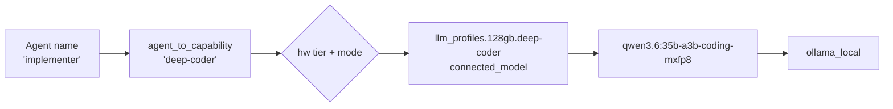
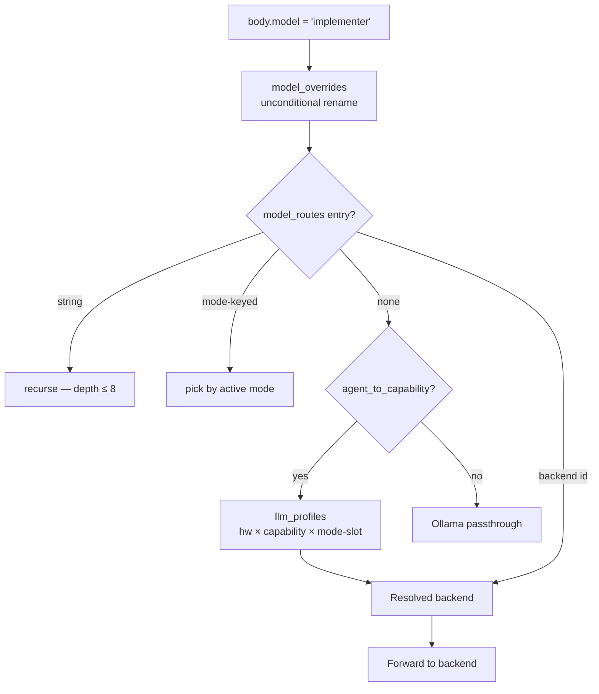
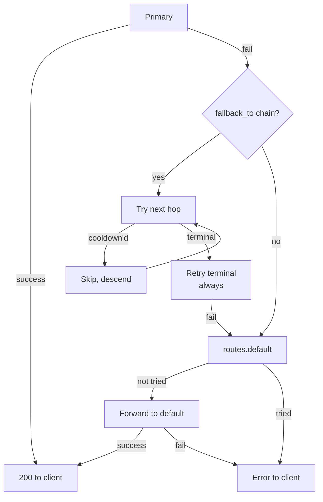
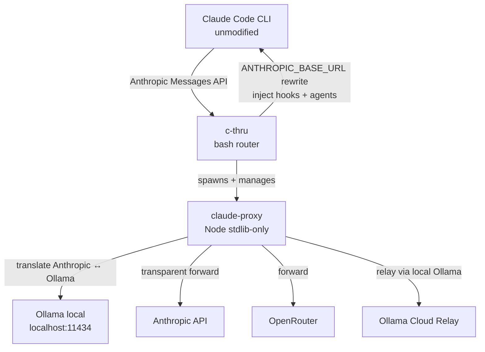

# c-thru

**Route Claude Code agents to the right model — local or cloud — without changing the CLI.**

c-thru is a transparent router/proxy that lets a single Claude Code session simultaneously use different LLMs for different tasks: the fast local model for quick scans, cloud Opus for high-stakes judgment, deepseek-r1 for root-cause debugging — all in the same session, automatically, based on which agent is talking.

```sh
git clone https://github.com/whichguy/c-thru.git && cd c-thru && ./install.sh
c-thru                        # launch Claude Code through c-thru
c-thru --mode local-only      # offline — all requests stay local
c-thru --mode cloud-only      # cloud only — no local models
```

---

## Table of Contents

- [What you get](#what-you-get)
- [Agent fleet](#agent-fleet)
- [How routing works](#how-routing-works)
- [Hardware tiers](#hardware-tiers)
- [Connectivity modes and offline](#connectivity-modes-and-offline)
- [Configuration](#configuration)
- [Observability](#observability)
- [CLI reference](#cli-reference)
- [Install and uninstall](#install-and-uninstall)
- [Running tests](#running-tests)
- [Further reading](#further-reading)

---

## What you get

### Transparent protocol bridge

Claude Code speaks Anthropic Messages API. Ollama speaks a different dialect. c-thru translates between them with full SSE fidelity — proper `event/data` lines, ping keepalives, thinking blocks, accurate token counts — so Claude Code never knows it's not talking to Anthropic.

### Per-agent model routing

Every Claude Code agent declares `model: <agent-name>` in its frontmatter. c-thru resolves that name to the right concrete model for your hardware and connectivity in two hops:

```
agent name → capability alias → llm_profiles[hw_tier][alias]
```

Change the backing model for every "coding" agent in one line. Rebind one agent to a higher tier in one line. Agent files never change.

### Fleet of 27+ pre-configured agents

Claude Code gets a fleet of specialized agents injected at session start. Each agent has a name chosen for what the underlying model is good at, and a description that tells Claude Code exactly when to invoke it. The proxy routes each agent to the right model automatically.

### Automatic hardware detection

c-thru detects your RAM and assigns a hardware tier (16gb / 32gb / 48gb / 64gb / 128gb). The same `judge` agent routes to `claude-opus-4-6` on a 128 GB machine and to `phi4-reasoning:plus` on a 32 GB machine offline — same config, automatic.

### Three-tier fallback

When a backend fails mid-request, the proxy walks a fallback chain before surfacing an error. The client sees a seamless stream; you see a `fallback.attempt` log line.

---

## Agent fleet

27 user-facing agents, organized by role. Each description is what Claude Code reads when deciding which agent to invoke.

### Reasoning and judgment

| Agent | Model backing | Description |
|---|---|---|
| `judge` | claude-opus-4-6 @128gb, claude-sonnet lower | Evaluator, planner, auditor. Hard-fail — never substitutes a weaker model. |
| `large-general` | claude-opus-4-6 @128gb, claude-sonnet lower | Highest-capability cross-domain reasoning. For tasks that exceed generalist capacity. |
| `reasoner` | deepseek-r1:32b @48gb+, r1:14b lower | Extended chain-of-thought for formal logic, verification, proof-checking. |
| `deep-code-debugger` | deepseek-r1:32b @48gb+, r1:14b lower | Root-cause analysis — multi-step causal chains, race conditions, memory leaks. Slow but verifiable. |
| `fast-code-debugger` | gemma4:26b @32gb+ (102 t/s, hard_fail) | Fast triage — candidate hypotheses in seconds. Escalate to deep-code-debugger when needed. |

### Coding

| Agent | Model backing | Description |
|---|---|---|
| `coder` | claude-sonnet-4-6 connected / qwen3-coder-next:latest offline | Precision instrument for surgical implementation. Connected-first. |
| `agentic-coder` | qwen3.6:35b-a3b-coding-nvfp4 @128gb, devstral-small-2:24b lower | Multi-step autonomous coding loops. Always local — never cloud. |
| `fast-coder` | devstral-small-2:24b-cloud connected, :24b local | 68% SWE-bench at 15GB. Best agentic repair-and-iterate loops. Cloud-relay when connected. |
| `deep-coder-precise` | qwen3.6:35b-a3b-mlx-bf16 @128gb, mxfp8 lower | Full-precision MLX-native coding for correctness-critical work. Quality over speed. |
| `refactor` | claude-sonnet + qwen3.6:35b-a3b-coding-mxfp8 | Code restructuring — internal quality without behavior change. |
| `implementer-heavy` | claude-sonnet-4-6 + qwen3-coder:30b @128gb (hard_fail) | Escalation target for local implementer recusals. Uplift or restart modes. |
| `test-writer-heavy` | claude-sonnet-4-6 + gpt-oss:20b @128gb (hard_fail) | Escalation target for test-writer recusals. Hard-fail for quality guarantee. |

### Generalist and document handling

| Agent | Model backing | Description |
|---|---|---|
| `generalist` | claude-sonnet-4-6 / qwen3.6:35b-a3b-coding-nvfp4 | Everyday questions, trade-off analysis, explanations. Default when no specialist fits. |
| `large-general` | claude-opus-4-6 / qwen3.6:35b-a3b-mlx-bf16 | Cross-domain tasks requiring maximum reasoning capacity. |
| `vision` | claude-sonnet-4-6 connected (full multimodal) / workhorse local | Screenshots, UI mockups, diagrams. Mixed visual+text tasks. |
| `image-analyst` | claude-sonnet-4-6 connected (full multimodal) / workhorse local | Dedicated visual analysis — screenshots, architecture diagrams, chart extraction. |
| `pdf` | claude-sonnet-4-6 / qwen3.6:35b-a3b-coding-nvfp4 | PDF parsing — tables, multi-column layouts, embedded figures. |
| `long-context` | claude-sonnet-4-6 + devstral-small-2:24b (384K context) | Needle-in-haystack, 50K+ token spans, large document retrieval. |
| `context-manager` | claude-sonnet-4-6 + devstral-small-2:24b | Compresses agent trajectories into handoff briefs. Session checkpointing. |
| `writer` | claude-opus-4-6 @128gb, claude-sonnet lower / mistral-small3.1:24b local | Long-form prose — docs, README files, release notes. Not for code. |

### Fast and lightweight

| Agent | Model backing | Description |
|---|---|---|
| `fast-generalist` | gemma4:26b (102 t/s, hard_fail) | Fastest generalist. Quick answers, TL;DR, one-liners. Same model connected and offline. |
| `fast-scout` | qwen3.6:27b-coding-nvfp4 @128gb, gemma4:e2b lower | Read-only reconnaissance. Maps file relationships, finds definitions. |
| `code-analyst-light` | gemma4:26b @128gb, gemma4:e2b lower | Fast pattern recognition, style checks, light scanning. High-frequency analysis. |
| `edge` | qwen3-coder:30b MoE (3.3B active, 18GB, 124 t/s) | Ultrafast transforms, classification, simple regex. CI-friendly. |
| `explorer` | gemma4:26b @128gb, devstral-small-2:24b lower | Answers a single gap question from codebase. Read-only, never speculates. |

### Code review and security

| Agent | Model backing | Description |
|---|---|---|
| `reviewer` | qwen3.6:35b-a3b-coding-mxfp8 @128gb, devstral-small-2:24b lower | Quality-focused code review — correctness, patterns, conventions. |
| `orchestrator` | claude-sonnet-4-6 + devstral-small-2:24b | Multi-step task coordinator. Routes work between specialized agents. |

### Wave-system agents (invoked by the planner, not directly)

| Agent | Capability tier | Role |
|---|---|---|
| `planner` | judge | Writes the dep-map; returns READY_ITEMS[] per wave |
| `implementer` | deep-coder | Core implementation within a wave |
| `test-writer` | code-analyst | Generates unit tests from implementation |
| `wave-reviewer` | code-analyst | Iterative review + fix loop (up to 5 iterations) |
| `scaffolder` | pattern-coder | File/directory scaffolding, stubs, boilerplate |
| `doc-writer` | orchestrator | Accurate API docs from actual code |
| `integrator` | orchestrator | Wires implementations together (routes, exports, DI) |
| `auditor` | judge | Exception-path wave direction (outcome_risk only) |
| `security-reviewer` | judge-strict (hard_fail) | Auth/injection/secrets — never degrades |
| `evaluator` | judge | Tournament scoring (Grand Tournament protocol) |
| `supervisor` | judge | Recursive Bayesian root-cause investigation |
| `uplift-decider` | judge | Routes local partial output: accept / uplift / restart |
| `final-reviewer` | judge | End-of-plan gap analysis vs original intent |

---

## How routing works

### The two-hop graph

```
agent name  →  agent_to_capability  →  llm_profiles[hw][capability]  →  concrete model
```

Example on a 128 GB machine in connected mode:

```
planner      → judge          → claude-opus-4-6           (cloud, strategic decisions)
implementer  → deep-coder     → qwen3.6:35b-coding-mxfp8  (local, always)
test-writer  → code-analyst   → qwen3.6:35b-coding-mxfp8  (local)
scaffolder   → pattern-coder  → qwen3-coder:30b            (local, fast)
fast-scout   → fast-scout     → qwen3.6:27b-coding-nvfp4   (local, read-only)
```



### User-facing agents: name == capability

All user-facing agents are **self-named** — the agent name equals its capability key. This means the routing table is self-documenting:

```
fast-code-debugger  →  fast-code-debugger  →  gemma4:26b (32gb+)
deep-code-debugger  →  deep-code-debugger  →  deepseek-r1:32b (48gb+)
writer              →  writer              →  claude-opus-4-6 (128gb)
edge                →  edge                →  qwen3-coder:30b (128gb)
```

Wave-internal agents route through shared capability tiers (judge, code-analyst, deep-coder) — that's intentional so you can swap all implementers and test-writers in one line.

### Full resolution graph

Every request walks:



ASCII:

```
body.model = "implementer"
   │
   ├──▶ model_overrides           unconditional rename (e.g. old-tag → new-tag)
   │
   ├──▶ model_routes              named graph edges:
   │       string target           "claude-opus-4-6" → "anthropic"
   │       mode-keyed object       { "cloud-only": "anthropic", "offline": "ollama_local" }
   │
   ├──▶ agent_to_capability       "implementer" → "deep-coder"
   │
   ├──▶ llm_profiles[hw][alias]   per-mode slots:
   │       connected_model / disconnect_model
   │       cloud_best_model / local_best_model
   │       modes.{semi-offload, cloud-judge-only, ...}
   │
   └──▶ effective backend         forward
```

### Three-tier fallback



Key invariants:
- **Terminal nodes never cooldown** — otherwise requests route nowhere
- **Cooldown skip** (60s) applies to intermediate hops only — turns `A→B→C` into `A→C` for that window
- **TTFT timeout** at 11s (`CLAUDE_PROXY_OLLAMA_TTFT_MS`) fails fast on hung Ollama upstreams
- **`hard_fail` capabilities** (judge-strict, fast-code-debugger) return an error immediately — no cascade

---

## Hardware tiers

RAM is auto-detected via `tools/hw-profile.js` and bucketed:

| Tier | RAM | Posture |
|---|---|---|
| `16gb` | < 24 GB | 1.7B models only; cloud for anything requiring reasoning |
| `32gb` | 24–40 GB | 14–24B local; cloud for judge/planning |
| `48gb` | 40–56 GB | 27–32B local; cloud for judge |
| `64gb` | 56–96 GB | 27–35B local; cloud as upgrade path |
| `128gb` | ≥ 96 GB | 35B local across the board; cloud for judge tier |

Model assignments per tier (excerpt):

| Agent | 16gb | 32gb | 64gb | 128gb connected | 128gb offline |
|---|---|---|---|---|---|
| `judge` / `planner` | qwen3:1.7b | claude-sonnet | claude-sonnet | claude-opus-4-6 | qwen3.6:35b-mlx-bf16 |
| `deep-code-debugger` | r1:14b | r1:14b | r1:32b | r1:32b | r1:32b |
| `fast-code-debugger` | r1:14b | gemma4:26b | gemma4:26b | gemma4:26b | gemma4:26b |
| `implementer` | qwen3.5:1.7b | claude-sonnet | claude-sonnet | qwen3.6:35b-mxfp8 | qwen3.6:35b-mxfp8 |
| `agentic-coder` | qwen3.5:1.7b | devstral-2:24b | devstral-2:24b | qwen3.6:35b-nvfp4 | qwen3.6:35b-nvfp4 |
| `fast-coder` | devstral-cloud | devstral-cloud | devstral-cloud | devstral-cloud | devstral-2:24b |
| `generalist` | qwen3:1.7b | claude-sonnet | claude-sonnet | qwen3.6:35b-nvfp4 | qwen3.6:35b-nvfp4 |
| `fast-generalist` | qwen3:1.7b | gemma4:26b | gemma4:26b | gemma4:26b | gemma4:26b |
| `writer` | qwen3:1.7b | claude-sonnet | claude-sonnet | claude-opus-4-6 | mistral-small3.1:24b |

Override at runtime:

```sh
c-thru --memory-gb 48 list        # treat as 48 GB for this run
c-thru --profile 128gb            # force tier
c-thru explain --capability judge # print resolution chain without spawning proxy
```

---

## Connectivity modes and offline

### Mode overview

16 modes controlling which model slot is picked per capability:

| Mode | Model slot used | Use when |
|---|---|---|
| `connected` | `connected_model` | Default — cloud reachable |
| `offline` / `local-only` | `disconnect_model` | No internet; all requests stay local |
| `semi-offload` | `modes.semi-offload` else `disconnect_model` | Local workers, cloud for judge/planning |
| `cloud-judge-only` | cloud for judge-tier only, local otherwise | Cloud quota for decisions only |
| `cloud-thinking` | cloud for thinking-capable capabilities | Cloud for complex reasoning |
| `cloud-best-quality` | `cloud_best_model` | Force best cloud model per capability |
| `local-best-quality` | `local_best_model` | Force best local model; no cloud |
| `cloud-only` | filter: only cloud backends | Pure cloud session |
| `local-only` | filter: only local backends | Pure local session |
| `fastest-possible` | filter: ranked by tokens/sec | Minimize latency |
| `smallest-possible` | filter: ranked by RAM | Minimize memory use |
| `best-opensource` | filter: best open-source overall | Best non-Anthropic model |
| `best-opensource-cloud` | filter: best open-source on cloud route | Cloud open-source |

```sh
c-thru --mode offline             # all requests to local Ollama
c-thru --mode semi-offload        # cloud only for judge/planner
c-thru --mode cloud-judge-only    # cloud for decisions, local for implementation
c-thru --mode local-best-quality  # best local, no cloud calls
```

### Offline mode

In `offline` or `local-only` mode, every capability uses its `disconnect_model`. At 128 GB:

```
judge / planner      → qwen3.6:35b-a3b-mlx-bf16   (full precision MLX-native, 70GB)
orchestrator         → devstral-small-2:24b          (384K context, 15GB)
implementer          → qwen3.6:35b-a3b-coding-mxfp8  (high precision coding, 38GB)
deep-code-debugger   → deepseek-r1:32b               (reasoning, 19GB)
fast-code-debugger   → gemma4:26b                    (102 t/s, 17GB)
writer               → mistral-small3.1:24b          (prose, 15GB)
```

Agents with `hard_fail` (judge-strict, fast-code-debugger) return an error rather than silently substituting a weaker model.

**Check what models are needed for your tier:**

```sh
c-thru explain --capability judge --mode offline --tier 128gb
c-thru list                    # shows active tier + all route resolutions
```

**Pull all models for your tier upfront:**

```sh
c-thru --mode local-only list  # shows which models are configured
# Then ollama pull each one listed as disconnect_model
```

---

## Configuration

### File hierarchy

```
~/.claude/model-map.system.json   ← shipped defaults (overwritten on install)
~/.claude/model-map.overrides.json  ← your customizations (never overwritten)
~/.claude/model-map.json          ← derived merge (regenerated at startup)

./  (project dir)
  .claude/model-map.json          ← project-local graph (takes precedence over profile)
```

Only the profile graph is layered (`system.json` + `overrides.json`). Project-local graphs are self-contained — they don't merge with the profile graph.

### Top-level keys in `model-map.json`

| Key | Purpose |
|---|---|
| `backends` | Connection metadata — kind (anthropic / ollama / openai), url, auth |
| `routes` | Named presets — `routes.default` is used when no flag is passed |
| `model_routes` | Per-model routing graph — string target or mode-keyed object |
| `model_overrides` | Unconditional renames before resolution (e.g. old-tag → new-tag) |
| `agent_to_capability` | Agent name → capability alias (1:1 for user-facing agents) |
| `llm_profiles` | Per-tier capability configs — connected/disconnect/best models + on_failure |

### Common overrides (`~/.claude/model-map.overrides.json`)

**Cloud-only:**
```json
{
  "llm_mode": "cloud-only",
  "routes": { "default": "claude-sonnet-4-6" }
}
```

**Local-only:**
```json
{
  "llm_mode": "local-only",
  "routes": { "default": "qwen3-coder:30b" }
}
```

**Cloud primary, Ollama fallback:**
```json
{
  "backends": {
    "anthropic": { "fallback_to": "ollama_local" }
  },
  "routes": { "default": "claude-sonnet-4-6" }
}
```

**Rebind one agent to a higher tier:**
```json
{
  "agent_to_capability": {
    "fast-coder": "deep-coder"
  }
}
```

**Unconditional model rename (e.g. use a newer tag):**
```json
{
  "model_overrides": {
    "qwen3-coder:30b": "qwen3-coder:32b"
  }
}
```

**Mode-conditional routing:**
```json
{
  "model_routes": {
    "my-model": {
      "cloud-only":  "claude-opus-4-6",
      "offline":     "qwen3.5:27b",
      "connected":   "claude-opus-4-6"
    }
  }
}
```

### Validate after editing

```sh
node tools/model-map-validate.js config/model-map.json
bash tools/c-thru-contract-check.sh
```

---

## Observability

### Per-request tracing

Every request gets a 4-char hex `req_id`. Every log line carries it:

```sh
grep <req_id> ~/.claude/proxy.*.log
```

Log events (excerpt): `request`, `dispatch`, `ollama.stream.first_chunk`, `ollama.stream.done`, `fallback.skip_cooldown`, `fallback.global_default`. Each line includes `elapsed_ms`.

### Proxy endpoints

```sh
curl http://127.0.0.1:<port>/ping           # liveness + active_tier + config_source
curl http://127.0.0.1:<port>/c-thru/status  # mode, tier, capabilities, usage
```

Find the port: `lsof -nP -iTCP -sTCP:LISTEN | grep claude-proxy` or `c-thru reload` (prints it).

### Response header

Capability-routed responses include `x-c-thru-resolved-via`:

```json
{
  "capability": "deep-coder",
  "served_by": "qwen3.6:35b-a3b-coding-mxfp8",
  "tier": "128gb",
  "mode": "connected"
}
```

### Skills (from a Claude Code session)

| Skill | Purpose |
|---|---|
| `/c-thru-status` | Routes, models, backend health |
| `/c-thru-config diag` | Mode, tier, capability→model table |
| `/c-thru-config reload` | SIGHUP proxy after editing config |
| `/c-thru-config mode <mode>` | Persist a mode change |
| `/c-thru-plan <intent>` | Wave-based agentic planner |
| `/cplan <intent>` | Shortcut for /c-thru-plan |

### Journal (opt-in, privacy-sensitive)

```sh
CLAUDE_PROXY_JOURNAL=1 c-thru   # records every request + response to ~/.claude/journal/
```

Captures full bodies (auth headers scrubbed). Off by default. See [`docs/journaling.md`](docs/journaling.md).

---

## CLI reference

### c-thru flags

These are stripped before forwarding to the real `claude` binary:

| Flag | Env var equivalent | Effect |
|---|---|---|
| `--mode <m>` | `CLAUDE_LLM_MODE` | Set connectivity/routing mode |
| `--profile <t>` | `CLAUDE_LLM_PROFILE` | Force hardware tier |
| `--memory-gb <n>` | `CLAUDE_LLM_MEMORY_GB` | Override RAM detection |
| `--bypass-proxy` | `CLAUDE_PROXY_BYPASS=1` | Skip proxy entirely (transparent Anthropic) |
| `--journal` | `CLAUDE_PROXY_JOURNAL=1` | Enable per-request journaling |
| `--proxy-debug [N]` | `CLAUDE_PROXY_DEBUG=N` | Proxy verbose logs (1 or 2) |
| `--router-debug [N]` | `CLAUDE_ROUTER_DEBUG=N` | Router verbose logs (1 or 2) |
| `--no-update` | `CLAUDE_ROUTER_NO_UPDATE=1` | Skip git self-update |

### c-thru subcommands

```sh
c-thru list                           # active hw profile, configured routes, Ollama models
c-thru reload                         # SIGHUP running proxy; wait for /ping confirm
c-thru restart [--force]              # SIGTERM + re-spawn proxy
c-thru explain --capability <cap>     # print resolution chain (no proxy spawn)
c-thru explain --agent <name>         # resolve through agent_to_capability first
c-thru check-deps [--fix]             # audit system deps; --fix runs brew install
```

### Key environment variables

| Variable | Effect |
|---|---|
| `CLAUDE_LLM_MODE` | Override connectivity mode |
| `CLAUDE_LLM_MEMORY_GB` | Override RAM detection (positive integer GB) |
| `CLAUDE_PROXY_BYPASS=1` | Skip proxy entirely |
| `CLAUDE_PROXY_JOURNAL=1` | Enable request journaling |
| `CLAUDE_PROXY_JOURNAL_DIR` | Override journal directory |
| `CLAUDE_MODEL_MAP_PATH` | Explicit model-map path override |
| `CLAUDE_PROFILE_DIR` | Override `~/.claude` location |
| `CLAUDE_PROXY_STREAM_STALL_MS` | Idle stream timeout (default 300s) |
| `CLAUDE_PROXY_STREAM_WALL_MS` | Wall-clock stream timeout (default 2100s) |
| `CLAUDE_ROUTER_NO_UPDATE=1` | Skip git self-update at startup |
| `CLAUDE_ROUTER_OLLAMA_AUTOSTART=1` | Auto-start Ollama if unreachable (default on) |
| `C_THRU_SKIP_PREPULL=1` | Skip background model pre-pull (CI/tests) |

---

## Install and uninstall

### Install

```sh
git clone https://github.com/whichguy/c-thru.git
cd c-thru
./install.sh
```

`install.sh`:
- Symlinks `tools/` into `~/.claude/tools/`
- Copies `config/model-map.json` → `~/.claude/model-map.system.json` (overwritten every install)
- Creates `~/.claude/model-map.overrides.json` if missing (your config — never overwritten)
- Registers hooks in `~/.claude/settings.json`
- Runs an end-to-end validation suite — aborts on failure

Add to PATH (installer does this idempotently):

```sh
export PATH="$HOME/.claude/tools:$PATH"
```

### Verify

```sh
bash -n tools/c-thru                                  # shell syntax
node --check tools/claude-proxy                       # node syntax
node tools/model-map-validate.js config/model-map.json
node test/model-map-v12-adapter.test.js               # adapter regression
c-thru check-deps                                     # audit jq, node, ollama, etc.
c-thru list                                           # active profile + routes
c-thru explain --capability workhorse                 # resolution chain (no proxy)
```

### Uninstall

```sh
./uninstall.sh              # shows what will be removed, prompts
./uninstall.sh --dry-run    # show only
./uninstall.sh --yes        # skip prompt
./uninstall.sh --purge-models  # also remove Ollama tags c-thru pulled
```

`uninstall.sh`:
- Removes c-thru symlinks under `~/.claude/tools/` (only ones pointing here)
- Deletes `~/.claude/model-map.system.json` and the derived `~/.claude/model-map.json`
- **Preserves `~/.claude/model-map.overrides.json`** — your data
- Surgically removes c-thru hook entries from `~/.claude/settings.json`
- Stops any running proxy

---

## Running tests

```sh
bash test/run-all.sh          # full suite
bash test/run-all.sh --fast   # skip slow/optional (e2e, smoke-check)
```

Individual suites:

```sh
# Shell tests
bash test/install-smoke.test.sh
bash test/ollama-probe.test.sh
bash test/preflight-model-readiness.test.sh
bash test/c-thru-contract-check.test.sh

# Node tests
node test/model-map-v12-adapter.test.js
node test/proxy-lifecycle.test.js
node test/proxy-forward-ollama-midstream-error.test.js
node test/proxy-client-disconnect-cleanup.test.js
node test/proxy-content-length-scrub.test.js
node test/proxy-cooldown-ttl.test.js
node test/model-map-config-project-overlay.test.js

# Validators
node tools/model-map-validate.js config/model-map.json
bash tools/c-thru-contract-check.sh
```

---

## Architecture



ASCII:

```
You type: c-thru

Claude Code (vendor CLI, unmodified)
    │  Anthropic Messages API
    ▼
c-thru (bash)        reads model-map.json, picks route + backend,
    │                exports env, spawns proxy, exec's `claude`
    ▼
claude-proxy (node)  translates Anthropic ↔ Ollama, applies fallbacks,
    │                emits SSE with proper event/data/ping framing
    ├──▶ Ollama local         qwen3-coder:30b, devstral-small-2:24b, gemma4:26b, ...
    ├──▶ Ollama cloud relay   deepseek-v4-flash:cloud, qwen3-coder-next:cloud
    ├──▶ OpenRouter           deepseek/deepseek-v3, ...
    └──▶ Anthropic            transparent passthrough
```

**No external Node dependencies.** `claude-proxy`, `llm-capabilities-mcp.js`, and all `model-map-*.js` helpers use Node stdlib only. No `package.json`, no `node_modules/`.

---

## Further reading

- [`docs/agent-architecture.md`](docs/agent-architecture.md) — full agent roster, wave lifecycle, STATUS contract
- [`docs/connectivity-modes.md`](docs/connectivity-modes.md) — all 17 modes, slot semantics
- [`docs/hardware-profile-matrix.md`](docs/hardware-profile-matrix.md) — full hw × capability table
- [`docs/model-map.md`](docs/model-map.md) — schema reference
- [`docs/journaling.md`](docs/journaling.md) — request/response journaling
- [`docs/capacity-audit-128gb.md`](docs/capacity-audit-128gb.md) — 128 GB VRAM analysis
- [`docs/dynamic-classification-phase-a.md`](docs/dynamic-classification-phase-a.md) — Phase A intent classifier
- [`CLAUDE.md`](CLAUDE.md) — instructions for Claude Code working in this repo

---

## License

MIT
