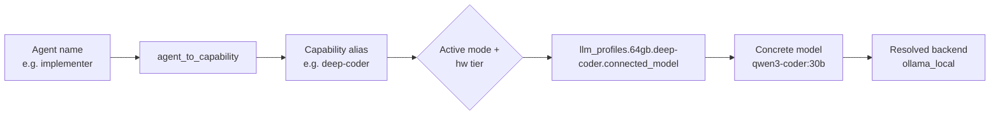
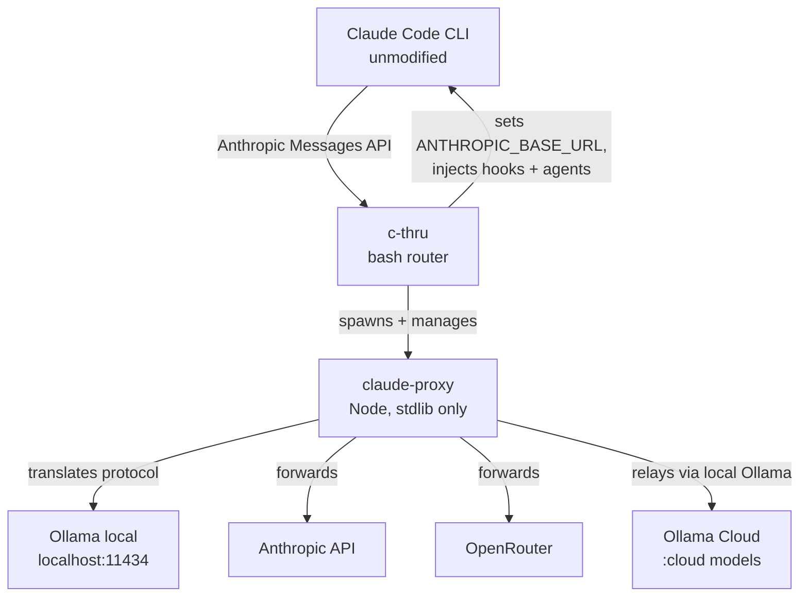
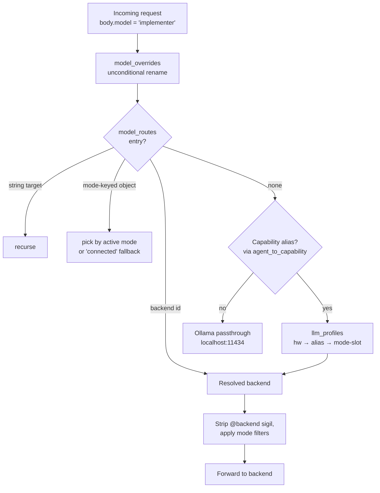
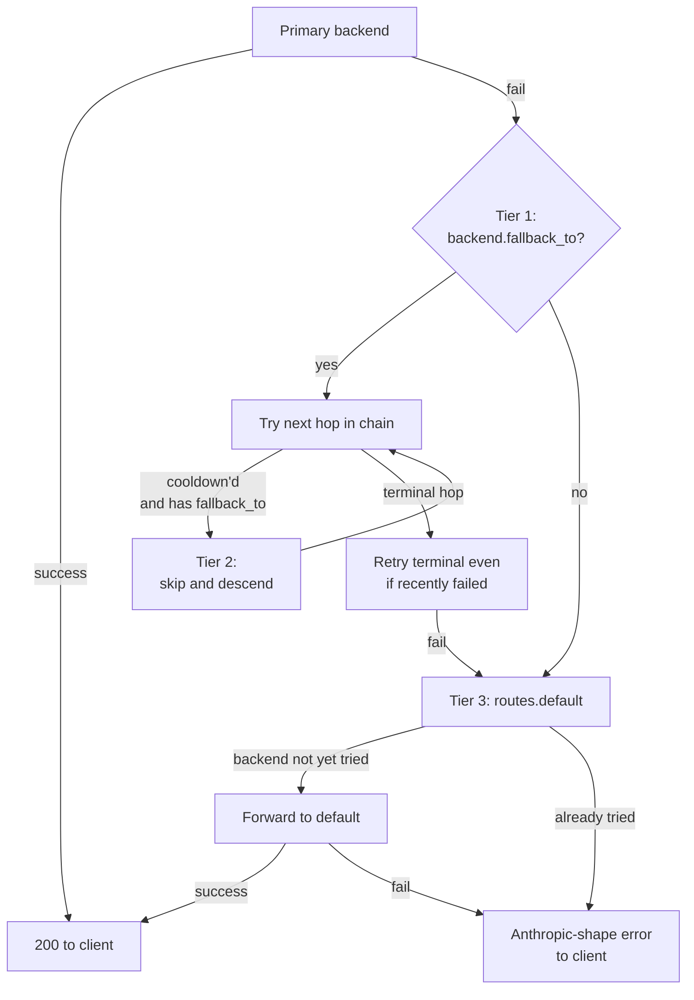

# c-thru

**c-thru** is a router/proxy that lets Claude Code talk to alternative model providers — Ollama (local or cloud-relayed), OpenRouter, or any Anthropic-compatible endpoint — without changing the vendor CLI. It bridges the Anthropic Messages API to Ollama-style backends with full SSE fidelity (proper event/data lines, ping keepalives, thinking blocks, accurate token counts), and routes individual Claude Code agents to appropriate-tier models based on hardware, connectivity, and capability.

```sh
git clone https://github.com/whichguy/c-thru.git
cd c-thru
./install.sh
c-thru   # launches Claude Code through c-thru
```

---

## Table of Contents

- [Why c-thru exists](#why-c-thru-exists)
- [The killer feature: agent → capability → model](#the-killer-feature-agent--capability--model)
- [Architecture](#architecture)
- [Resolution graph](#resolution-graph)
- [Three-tier fallback](#three-tier-fallback)
- [Hardware-tier-aware routing](#hardware-tier-aware-routing)
- [Connectivity modes](#connectivity-modes)
- [Configuration recipes](#configuration-recipes)
- [Observability](#observability)
- [Install and uninstall](#install-and-uninstall)
- [Honest about limits](#honest-about-limits)
- [Further reading](#further-reading)
- [License](#license)

---

## Why c-thru exists

Claude Code is locked to Anthropic's billing path. Local Ollama models are good enough for most coding work — but there's no transparent bridge that:

- preserves Claude Code's wire protocol so streaming, tool use, and multi-turn context all work,
- routes individual agents inside a single session to different models (cheap fast model for the scout, judge-class model for review, heavy coder for implementation),
- adapts when the network goes away or a backend hangs,
- tells you what it actually did, per request.

That's c-thru. It wraps `claude`, rewrites `ANTHROPIC_BASE_URL` and credentials per launch, auto-spawns a local proxy, and translates Anthropic Messages API to whatever the backend speaks.

---

## The killer feature: agent → capability → model

A single Claude Code session uses 5+ different models simultaneously. You don't configure that per agent — you configure it once per capability tier, and every agent that needs that tier picks up the model.

Each agent file (`agents/*.md`) declares a `model:` matching its name. The proxy resolves that name in two hops: first to a capability alias (`judge`, `deep-coder`, `explorer`, ...), then to the concrete model for the active hardware tier and connectivity mode.

```
You ask: "/c-thru-plan add a palindrome checker"
         (128 GB machine, connected mode)

  planner agent       → judge          → claude-opus-4-6              (cloud, decisions)
  explorer agent      → explorer       → gemma4:26b-a4b               (local, fast)
  implementer agent   → deep-coder     → qwen3-coder:30b              (local, heavy)
  test-writer agent   → code-analyst   → phi4-reasoning:latest        (local, careful)
  scaffolder agent    → pattern-coder  → qwen3-coder:30b              (local, small)
  doc-writer agent    → orchestrator   → claude-sonnet-4-6            (cloud, mid)
```



Two consequences of this design:

- **Rebind one agent to a different tier:** change one line in `agent_to_capability`. Agent file untouched.
- **Swap a tier's backing model:** change one line in `llm_profiles[<hw>][<alias>]`. Every agent on that tier follows.

Capability aliases shipped today (excerpt — full list in `config/model-map.json`):

| Alias | Cognitive tier | Used by |
|---|---|---|
| `judge` | cloud or 27B+ local | planner, auditor, review-plan, final-reviewer, judge |
| `judge-strict` | cloud or 27B+, hard_fail | security-reviewer |
| `deep-coder` | local coding model | implementer, refactor |
| `agentic-coder` | local coding model (agentic) | agentic-coder |
| `code-analyst` | local mid-tier | test-writer, wave-reviewer, wave-synthesizer, converger |
| `reviewer` | local review-focused | reviewer |
| `pattern-coder` | local small | scaffolder, edge, discovery-advisor, learnings-consolidator |
| `explorer` | small + low latency | explorer |
| `fast-scout` | small + latency-optimised | fast-scout |
| `orchestrator` | mid-tier local | plan-orchestrator, integrator, doc-writer |
| `reasoner` | reasoning-class local | reasoner |

How multiple agents resolve simultaneously in one session (128 GB machine, `connected` mode):

```mermaid
sequenceDiagram
    participant CC as Claude Code
    participant P as claude-proxy
    participant A as Anthropic API
    participant O as Ollama local

    CC->>P: POST /v1/messages model=planner
    P->>P: planner → judge → claude-opus-4-6
    P->>A: forward (claude-opus-4-6)
    A-->>CC: stream response

    CC->>P: POST /v1/messages model=implementer
    P->>P: implementer → deep-coder → qwen3-coder:30b
    P->>O: forward (qwen3-coder:30b)
    O-->>CC: stream response

    CC->>P: POST /v1/messages model=scaffolder
    P->>P: scaffolder → pattern-coder → qwen3-coder:30b
    P->>O: forward (qwen3-coder:30b)
    O-->>CC: stream response

    CC->>P: POST /v1/messages model=test-writer
    P->>P: test-writer → code-analyst → phi4-reasoning:latest
    P->>O: forward (phi4-reasoning:latest)
    O-->>CC: stream response
```



Agent files and `--model` flags never change — only `agent_to_capability` and `llm_profiles` in `config/model-map.json`.

---

## Architecture



ASCII fallback:

```
You type: c-thru

Claude Code (vendor CLI, unmodified)
    │  Anthropic Messages API
    ▼
c-thru (bash)        reads model-map.json, picks route + backend,
    │                exports env, spawns proxy, exec's `claude`
    ▼
claude-proxy (node)  translates Anthropic ↔ Ollama, applies fallbacks,
    │                emits SSE with proper event/data/ping framing
    ├──▶ Ollama (local)         qwen3-coder:30b, devstral-2, gemma4:26b, ...
    ├──▶ Ollama (cloud relay)   glm-5.1:cloud, deepseek-v4-flash:cloud
    ├──▶ OpenRouter             deepseek/deepseek-v3, …
    └──▶ Anthropic              transparent passthrough
```

The router strips its own flags (`--mode`, `--profile`, `--route`, `--model`, `--memory-gb`, `--bypass-proxy`, `--journal`, `--proxy-debug`, `--router-debug`, `--no-update`) before invoking `claude`. The proxy is a long-running local HTTP server; multiple c-thru sessions converge on a single proxy via flock, port auto-selected, logs at `~/.claude/proxy.log` (rotates to `proxy.log.old` at 10 MB).

**No external Node deps.** `claude-proxy`, `llm-capabilities-mcp.js`, and the `model-map-*.js` helpers all use Node stdlib (`http`, `https`, `fs`, `path`, `os`, `crypto`, `child_process`). There is no `package.json` and no `node_modules/`.

---

## Resolution graph

Every request walks this graph. Each step is configured in `config/model-map.json`.



ASCII:

```
body.model = "implementer"
   │
   ├──▶ model_overrides           unconditional name substitution (e.g. gemma4:26b → gemma4:31b)
   │
   ├──▶ model_routes              named graph edges:
   │       string target           "claude-opus-4-6" → "anthropic"
   │       mode-keyed object       { "cloud-only": "anthropic", "connected": "ollama_local" }
   │       (recurses if target is another model name; cycle/depth guarded at 8 hops)
   │
   ├──▶ agent_to_capability       "implementer" → "deep-coder"
   │
   ├──▶ llm_profiles[hw][alias]   per-mode slots:
   │       connected_model  / disconnect_model
   │       cloud_best_model / local_best_model
   │       modes.{semi-offload, cloud-judge-only, cloud-thinking, local-review, …}
   │
   └──▶ effective backend         strip @sigil, apply mode-level filters, forward
```

Top-level keys in `model-map.json`: `backends`, `routes`, `model_routes`, `model_overrides`, `agent_to_capability`, `llm_profiles`. Schema details: [`docs/model-map.md`](docs/model-map.md).

---

## Three-tier fallback

When a backend fails, the proxy walks three tiers before surfacing the error.



ASCII:

```
Tier 1: per-backend fallback_to chain    user's declared graph in backends[*].fallback_to
Tier 2: skip recently-failed nodes       cooldown TTL ~60s; only intermediate nodes —
                                         terminal nodes never enter cooldown
Tier 3: routes.default last resort       global safety net; tried at most once per request
```

Key invariants (enforced in `tools/claude-proxy`):

- **Terminal nodes never cooldown.** If `D` is the end of `A→B→C→D`, `D` is always retried even when it just failed — otherwise the system would route a request to "nowhere".
- **Cooldown skip only applies to intermediate hops.** A 60s cooldown on `B` turns `A→B→C→D` into effectively `A→C→D` for that window.
- **`routes.default` itself never cooldowns.** It's the absolute terminal of the system.
- **Cycle and depth guards.** Resolution depth capped at 8 hops; visited set prevents loops.
- **TTFT fast-fail.** Hung Ollama upstreams that don't return HTTP headers within 11s (`CLAUDE_PROXY_OLLAMA_TTFT_MS`) trigger the fallback. The total upstream timeout (5min default) covers actual generation.

You see the chosen path in the proxy log's `dispatch` event: `incoming_model`, `resolved_model`, `backend_id`, `logical_role`, `tier`, `mode`.

---

## Hardware-tier-aware routing

RAM is auto-detected at startup via `tools/hw-profile.js` and bucketed into 5 tiers:

| Tier | RAM range | Posture |
|---|---|---|
| `16gb` | < 24 GB | tiny local + cloud for anything heavy |
| `32gb` | 24–40 GB | small local, cloud for judge-class |
| `48gb` | 40–56 GB | mid local, cloud for judge-class |
| `64gb` | 56–96 GB | mid-large local, cloud as upgrade |
| `128gb` | ≥ 96 GB | large local across the board |

The same agent routes to different models depending on what your machine can run. Excerpt:

| Machine | Mode | judge (planner) | orchestrator | deep-coder (implementer) |
|---|---|---|---|---|
| 128 GB | connected | claude-opus-4-6 | claude-sonnet-4-6 | qwen3-coder:30b |
| 128 GB | offline | phi4-reasoning:latest | devstral-small:2 | qwen3-coder:30b |
| 64 GB | connected | claude-sonnet-4-6 | claude-sonnet-4-6 | claude-sonnet-4-6 |
| 64 GB | offline | phi4-reasoning:latest | gpt-oss:20b | devstral-small:2 |
| 16 GB | any | qwen3:1.7b | qwen3:1.7b | qwen3.5:1.7b |

Verify and override:

```sh
c-thru list                              # show detected tier + active routes
c-thru --memory-gb 48 list                # treat as 48 GB for this run
c-thru --profile 128gb                    # force a tier
c-thru explain --capability deep-coder    # print resolution chain (no proxy spawn)
```

The shipped 128 GB profile is currently **VRAM-oversubscribed** if many local models load simultaneously — see [`docs/capacity-audit-128gb.md`](docs/capacity-audit-128gb.md) for the worst-case sums and recommended downgrades.

---

## Connectivity modes

10 documented modes ([`docs/connectivity-modes.md`](docs/connectivity-modes.md)). 17 accepted at the CLI (the remaining 7 are filter/ranking modes that compose with `model_routes` rather than picking a profile slot).

| Mode | Slot used | Use when |
|---|---|---|
| `connected` | `connected_model` | Normal — cloud reachable |
| `offline` / `local-only` | `disconnect_model` | No internet (or want zero cloud calls) |
| `semi-offload` | `modes.semi-offload` → `disconnect_model` | Local workers, cloud for high-stakes |
| `cloud-judge-only` | `modes.cloud-judge-only` → `disconnect_model` | Cloud only for judge/audit |
| `cloud-thinking` | `modes.cloud-thinking` → `disconnect_model` | Cloud for thinking-class capabilities |
| `local-review` | `modes.local-review` → `connected_model` | Inverse — review/security stays local |
| `cloud-best-quality` | `cloud_best_model` | Force best cloud model |
| `local-best-quality` | `local_best_model` | Force best local; no cloud |
| `best-opensource-cloud` | per spec | Best open-source on cloud-only routes |

Filter/ranking modes that operate post-resolution against `docs/benchmark.json`: `cloud-only`, `claude-only`, `opensource-only`, `fastest-possible`, `smallest-possible`, `best-opensource`, `best-opensource-local`.

```sh
c-thru --mode cloud-judge-only            # cloud for high-stakes only
c-thru --mode local-only                  # never call cloud
c-thru --mode local-review                # invert — review locally, build cloud
```

Each capability declares `on_failure: "cascade"` (default) or `"hard_fail"`. `hard_fail` (used by `judge-strict`) returns a clean error rather than silently substituting a weaker model.

---

## Configuration recipes

All four examples are minimal — drop into `~/.claude/model-map.overrides.json` to layer over shipped defaults.

### Cloud-only with Anthropic

```json
{
  "llm_mode": "cloud-only",
  "routes": { "default": "claude-sonnet-4-6" }
}
```

Every request goes to Anthropic. Local backends are filtered out post-resolution.

### Local-only with Ollama

```json
{
  "llm_mode": "local-only",
  "routes": { "default": "qwen3-coder:30b" }
}
```

Ollama at `localhost:11434`. No cloud calls regardless of capability slots.

### Cloud primary, local fallback

```json
{
  "backends": {
    "anthropic": {
      "fallback_to": "ollama_local"
    }
  },
  "routes": { "default": "claude-sonnet-4-6" }
}
```

If Anthropic 5xxs, times out, or fails TTFT, the proxy falls back to local Ollama transparently — same request body, no client retry. Visible in logs as `fallback.attempt`.

### Mode-conditional `model_routes`

`model_routes` entries can be plain strings or mode-keyed objects:

```json
{
  "model_routes": {
    "judge-best": {
      "cloud-only":          "claude-opus-4-6",
      "local-only":          "qwen3.5:27b",
      "cloud-best-quality":  "claude-opus-4-6",
      "local-best-quality":  "qwen3.5:27b",
      "connected":           "claude-opus-4-6",
      "offline":             "qwen3.5:27b"
    }
  }
}
```

The active mode picks the slot; missing modes fall back to `connected`. Cycle detection caps recursion depth at 8.

---

## Observability

### Per-request grep

Every request gets a 4-char hex `req_id`. Every log line for that request carries it. To trace a single request end-to-end:

```sh
grep <req_id> ~/.claude/proxy.log
```

Events you'll see (excerpt): `request`, `dispatch`, `ollama.stream.first_chunk`, `ollama.stream.done`, `fallback.skip_cooldown`, `fallback.global_default`. The proxy writes structured key=value lines including `elapsed_ms`.

### Response headers

On capability-routed responses, the proxy logs a `dispatch` event with the same fields. The `x-c-thru-resolved-via` response header is planned but not yet emitted; use `c-thru explain` or the `/c-thru/status` endpoint to inspect current routing without live traffic.

### Status endpoints and skills

```sh
curl http://127.0.0.1:<proxy_port>/ping         # liveness, prints active_tier + config_source
curl http://127.0.0.1:<proxy_port>/c-thru/status # mode, tier, capabilities, usage stats
```

From a Claude session:

| Skill | Purpose |
|---|---|
| `/c-thru-status` | Routes, models, backend health |
| `/c-thru-config diag` | Mode, tier, capability→model table, proxy status |
| `/c-thru-config resolve <cap>` | What does this capability resolve to right now? |
| `/c-thru-config mode <mode>` | Persist a mode change |
| `/c-thru-config reload` | SIGHUP the running proxy after editing the map |
| `/c-thru-plan <intent>` (or `/cplan`) | Wave-based agentic planner |

### Journal (opt-in)

`CLAUDE_PROXY_JOURNAL=1` records every request and response (auth scrubbed) to `~/.claude/journal/YYYY-MM-DD/<capability>.jsonl`. See [`docs/journaling.md`](docs/journaling.md) — it's privacy-sensitive, off by default.

---

## Install and uninstall

`./install.sh` symlinks tools into `~/.claude/tools/`, seeds `~/.claude/model-map.system.json` (always overwritten — never edit), creates `~/.claude/model-map.overrides.json` if missing (your config; never overwritten on upgrade), and registers hooks in `~/.claude/settings.json`. It also runs an end-to-end validation suite (syntax checks, schema validation, proxy `/ping` round-trip, hook registration check) — failures abort install rather than leaving you with a half-broken setup.

Add `~/.claude/tools` to PATH (the installer does this idempotently for zsh/bash):

```sh
export PATH="$HOME/.claude/tools:$PATH"
```

`./uninstall.sh` is the inverse:

- Removes c-thru symlinks under `~/.claude/tools/` (only ones pointing back into this repo).
- Deletes `~/.claude/model-map.system.json` and the derived `~/.claude/model-map.json`.
- **Preserves `~/.claude/model-map.overrides.json`** — that's your data.
- Surgically removes c-thru hook entries from `~/.claude/settings.json` (other hooks left alone).
- Stops any running proxy.
- Optional `--purge-models` to also drop Ollama tags c-thru pulled (tracked separately from your manual pulls).
- Default mode shows what will be removed and prompts; `--dry-run` and `--yes` available.

Verify a working install:

```sh
bash -n tools/c-thru                         # shell syntax
node --check tools/claude-proxy              # node syntax
node tools/model-map-validate.js config/model-map.json
node test/model-map-v12-adapter.test.js      # adapter regression
c-thru check-deps                            # audit jq, node, ollama, etc.
c-thru list                                  # active profile + routes
c-thru explain --capability workhorse        # resolution chain (pure JS, no proxy)
```

---

## Honest about limits

This README itself is a first-pass rewrite — see `TODO.md` entry **`[docs] Full repo audit + thoughtful README rewrite`** for the full audit scope (cross-checking every claim/env-var/skill against actual code, agent-by-agent purpose tables, file-by-file tool inventory). What's here is true and verified, but there's more depth to surface.

Other open work that affects users today (full list in `TODO.md`):

- **Test-coverage audit** (`[review]`). The proxy has 30+ defensive branches in `forwardOllama` alone. Test coverage exists but is uneven — TTFT, fallback, cooldown are exercised; mid-stream parse errors, ping-interval firing, content-length scrub effectiveness, and cooldown TTL expiry are not.
- **Breadcrumb-comments pass** (`[docs]`). Some hot paths (SSE state machine, fallback invariants) are well-annotated; others (bash router lock-and-spawn, `model-map-resolve.js` mode handling) are bare.
- **Senior-engineer review of `tools/claude-proxy`** (`[review]`). The proxy is ~1000+ lines doing real work; `forwardOllama` is ~250 lines doing translation + streaming + state machine + pings + watchdog + usage. Splitting into smaller functions is open work.
- **128 GB VRAM oversubscription** (`[capacity]`). Shipped 128 GB profile worst-cases at ~193 GB resident across 13 distinct local models. Realistic heavy use lands at 85–159 GB. See [`docs/capacity-audit-128gb.md`](docs/capacity-audit-128gb.md) for the recommended downgrades.
- **Token-usage stats** (`[stats]`). Wired up but only surfaced via `/c-thru/status` REST — the `/c-thru-status` skill doesn't render them yet.
- **Ollama cloud fallback** (`[ollama]`). `:cloud`-suffixed models that fail with auth errors should fall back to local — implemented for `forwardAnthropic`, partially mirrored into `forwardOllama`, but cloud-failure-shape detection is heuristic.

If a feature claim in this README doesn't hold for you, file an issue. Don't assume it's user error.

---

## Further reading

- [`docs/agent-architecture.md`](docs/agent-architecture.md) — full agent roster, wave lifecycle, STATUS contract
- [`docs/connectivity-modes.md`](docs/connectivity-modes.md) — all 16 modes, slot semantics, filter rules
- [`docs/hardware-profile-matrix.md`](docs/hardware-profile-matrix.md) — full hw × capability table
- [`docs/model-map.md`](docs/model-map.md) — schema reference
- [`docs/journaling.md`](docs/journaling.md) — request/response journaling
- [`docs/capacity-audit-128gb.md`](docs/capacity-audit-128gb.md) — 128 GB tier VRAM analysis
- [`docs/dynamic-classification-phase-a.md`](docs/dynamic-classification-phase-a.md) — Phase A intent classifier
- [`CLAUDE.md`](CLAUDE.md) — instructions for Claude Code working in this repo

---

## License

MIT
