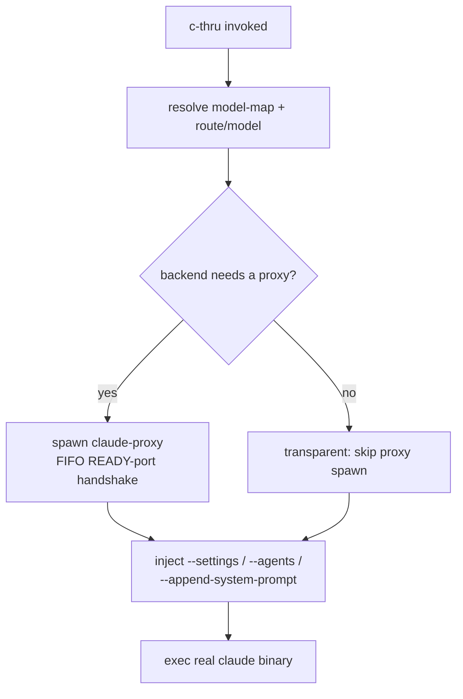

# c-thru

**A router and proxy that lets Claude Code talk to alternative model providers — Ollama, OpenRouter, Bedrock, Vertex, Gemini, LiteLLM — without modifying the vendor CLI.**

`c-thru` slots between an unmodified Claude Code binary and your chosen backend(s). It selects models per hardware tier, translates Anthropic's Messages API to other wire protocols where needed, and forwards everything else verbatim. A single session can run a planner against cloud Sonnet and a coder against a local Qwen3.6.

> **Intent.** c-thru is a transparent LLM router for Claude Code: it proxies the Anthropic Messages API and re-routes each request — by **capability**, **hardware tier**, and **connectivity mode** — to local Ollama, OSS cloud (OpenRouter), Gemini, Bedrock, or Anthropic, translating wire formats and orchestrating a **22-agent fleet**, with no change to the Claude Code binary. See [Use cases](#use-cases) for what that buys you and [Agent routing reference](#agent-routing-reference) for the full agent→model→endpoint mapping.

---

## Quick start

Install the plugin from the `claude-craft` marketplace:

```
/plugin marketplace add whichguy/claude-craft
/plugin install c-thru@claude-craft
/plugin install planning-suite@claude-craft
```

> **`planning-suite` is required** for `/cplan` and the wave-based plan scheduler. Skip it only if you don't intend to use the agentic planning skill.

Restart Claude Code. The `SessionStart` hook spawns the proxy on a fixed port and writes `ANTHROPIC_BASE_URL` into your settings; subsequent launches pick it up automatically. Verify with:

```
/c-thru-status
```

You should see the active routing profile, proxy URL, configured routes, and (if reachable) local Ollama models. If the proxy isn't reachable or the model-map is missing, run `/c-thru-status fix` to apply recommended mappings and reload.

> **The marketplace plugin gives you proxy + routing, not the full agentic workflow.** `/cplan` and the 22-agent fleet depend on the agent files being injected via `--agents`, which only happens on the CLI install path. If you want the planner/coder/reviewer pipeline, see [Appendix A](#appendix-a-cli-install-for-contributors-and-advanced-users).

### Cloud backends

Using a Claude.ai subscription instead of API billing? See [`docs/subscription-auth.md`](docs/subscription-auth.md) — no API key needed.

Otherwise, export keys for whichever cloud providers you want to route to. None of these are required — local-only routing works without any keys.

```bash
export ANTHROPIC_API_KEY="sk-ant-..."
export OPENROUTER_API_KEY="sk-or-..."
export GOOGLE_API_KEY="..."               # Gemini AI Studio
```

---

## Plugin vs CLI: which install do I want?

The marketplace plugin is the right starting point for most users. The CLI install path (`./install.sh`, see [Appendix A](#appendix-a-cli-install-for-contributors-and-advanced-users)) adds a `c-thru` terminal binary and the surfaces that need it: the agent fleet, the `llm-capabilities` MCP server, runtime control subcommands, and flag-driven mode/profile selection.

| Surface | Plugin (marketplace) | CLI (`./install.sh`) |
|---|:---:|:---:|
| `claude-proxy` runtime + auto-spawn on session start | ✓ | ✓ |
| Model-map seeding (`model-map.system.json`, overrides preserved) | ✓ | ✓ |
| `ANTHROPIC_BASE_URL` auto-registration in settings | ✓ | (set per launch) |
| Slash commands `/c-thru-status`, `/cplan` | ✓ | ✓ |
| Skills `c-thru-plan`, `c-thru-config`, `c-thru-control` | ✓ | ✓ |
| User-wide hooks — fire in every Claude Code session (SessionStart, UserPromptSubmit, PostToolUse, PreCompact) | ✓ | — |
| Project hooks — fire only inside the c-thru repo working tree (SessionStart, PostCompact, FileChanged, PostToolUse on `model-map.json`) | — | ✓ |
| `c-thru` binary on PATH | — | ✓ |
| Control subcommands (`list`, `reload`, `restart`, `explain`, `stats`, `check-deps`) | — | ✓ |
| Flags (`--mode`, `--profile`, `--bypass-proxy`, `--journal`, `--router-debug`) | (use env vars) | ✓ |
| Agent fleet (22 agents) injected via `--agents` | — | ✓ |
| `llm-capabilities` MCP server injected via `--settings` | — | ✓ |
| Contributor checks (`c-thru-contract-check`, `c-thru-hygiene-check`) | — | ✓ |

Plugin hooks fire globally in every Claude Code session; the CLI install's hooks fire only when Claude Code runs inside the c-thru repo working tree (`install.sh` deliberately strips persistent user-wide hooks from `~/.claude/settings.json`).

Plugin users can still drive routing via environment variables — `CLAUDE_LLM_MODE`, `CLAUDE_LLM_PROFILE`, `CLAUDE_LLM_MEMORY_GB`, `CLAUDE_PROXY_BYPASS`, `CLAUDE_PROXY_JOURNAL` all work the same way the CLI flags do. The flags are a CLI convenience, not a capability difference at the proxy layer.

---

## How c-thru works

The bash entrypoint selects a model-map and routing mode, spawns the Node proxy (unless
`CLAUDE_PROXY_BYPASS=1` is set), and execs the real `claude` binary with ephemeral session
injection. The proxy translates Anthropic ↔ Gemini / Ollama and forwards everything else; agent
files declare logical capability names (`planner`, `coder`, ...) that the proxy resolves to
concrete models at request time.

<!-- BEGIN shared-diagram:launch-flow -->

```mermaid
flowchart TD
    A[c-thru invoked] --> B[resolve model-map + route/model]
    B --> C{backend needs a proxy?}
    C -- yes --> D[spawn claude-proxy<br/>FIFO READY-port handshake]
    C -- no --> E[transparent: skip proxy spawn]
    D --> F[inject --settings / --agents /<br/>--append-system-prompt]
    E --> F
    F --> G[exec real claude binary]
```
<!-- END shared-diagram:launch-flow -->

Full flow with every branch (native-subcommand bypass, `--bypass-proxy`, backend lookup ladder,
FIFO handshake failure modes): [docs/architecture-diagrams.md § 1](docs/architecture-diagrams.md#1-cli-launch--proxy-spawn--claude-exec).

claude-proxy (Node.js, stdlib only):
  - resolves capability alias → llm_profiles[capability][mode][tier] → concrete model
  - rewrites: model field, URL/Host, auth headers, model_overrides, @sigil
  - translates Anthropic ↔ Gemini where needed (forwardGemini)
  - forwards Ollama via /v1/messages (Ollama 0.4+) — preserves tool_use, thinking
  - catch-all passthrough for anything not explicitly handled
  - stamps x-c-thru-* response headers (resolved-via, translation-gap, …)

> The `--settings`, `--agents`, and `--append-system-prompt` injections only happen on the CLI install path. Plugin users get the proxy and `ANTHROPIC_BASE_URL` registration only — agent files and the `llm-capabilities` MCP are not loaded that way.

Two components, both in `tools/`:

- **`tools/c-thru`** (bash) — entrypoint. Config selection, Ollama lifecycle, agent injection, exec into claude.
- **`tools/claude-proxy`** (Node.js) — long-running HTTP server. Capability resolution, auth, fallback chains, SIGHUP reload, translation. **No external Node deps** — stdlib only.

> **Gate philosophy.** The proxy answers as many incoming Claude Code calls as possible — gating only when truly unreachable. A passthrough catch-all forwards anything not explicitly translated; OAuth and bootstrap paths (`/v1/oauth/token`, file content download) are never gated; a structured 501 is reserved for paths that are genuinely unsupported on the configured backend. Translation gaps surface on the response via the `x-c-thru-translation-gap` header rather than failing silently. Full endpoint × backend matrix: [`docs/anthropic-api-coverage.md`](docs/anthropic-api-coverage.md).

---

## Routing modes

Set with `CLAUDE_LLM_MODE` (or `--mode <name>` on the CLI):

| Mode | Description |
|---|---|
| `best-cloud` | Anthropic + Gemini cloud; local fallback at 64 GB+ (default) |
| `best-cloud-oss` | OSS cloud via OpenRouter (DeepSeek, Kimi, Qwen) |
| `best-local-oss` | Fully local (Phi, Qwen, Devstral) |
| `best-cloud-gov` | US-Gov compliant cloud (non-Chinese-origin) |
| `best-local-gov` | US-Gov compliant local |

Hardware tier is auto-detected from `os.totalmem()`; override with `CLAUDE_LLM_PROFILE` (or `--profile <tier>`): `16gb` / `32gb` / `48gb` / `64gb` / `128gb`.

---

## Use cases

What c-thru is *for* — the scenarios the router/proxy/fleet exist to serve. Each maps to a [routing mode](#routing-modes) and exercises a representative slice of the [agent fleet](#agents); the [Agent routing reference](#agent-routing-reference) shows exactly which model each agent lands on.

| # | Use case | Mode(s) | Representative agents |
|---|---|---|---|
| 1 | **Fully-local / air-gapped dev** — no cloud egress; everything on local Ollama | [`best-local-oss`](#routing-modes) | `planner`, `coder`, `tester`, `docs` |
| 2 | **Cost-optimized mixed cloud** — OSS cloud for bulk work, Anthropic only for the hard tiers | [`best-cloud-oss`](#routing-modes) | `coder`, `debugger-hard`, `planner-hard` |
| 3 | **Max-quality cloud** — Opus / Sonnet / Gemini per role | [`best-cloud`](#routing-modes) | `planner-hard`, `reviewer-security`, `coder` |
| 4 | **Compliance / data-sovereignty** — Chinese-origin models filtered out | [`best-cloud-gov`](#routing-modes) / [`best-local-gov`](#routing-modes) | `planner`, `code-reviewer`, `tester` |
| 5 | **Hardware-tiered auto-scaling** — same config; `16gb`→`128gb` resolves to different concrete models | any (varies by `--profile`) | whole fleet |
| 6 | **Agentic wave planning** — `/cplan` drives a planner→coder→reviewer→tester→docs pipeline with state | any | `plan-scheduler`, `planner`, `coder`, `code-reviewer`, `tester`, `docs` |
| 7 | **Role-based model mixing in one session** — Claude plans, local Qwen codes, Gemini debugs | [`best-cloud`](#routing-modes) | `planner` (Anthropic), `coder`/`tester` (Ollama), `debugger-investigate` (Gemini) |
| 8 | **Fallback-chain resilience** — primary backend down → cascade to the next; `hard_fail` tiers opt out | any | `coder`→`coder-fallback`, `reviewer-security` (`hard_fail`) |
| 9 | **Runtime remap without restart** — edit the model-map + SIGHUP reload | any | whole fleet |
| 10 | **Observability / audit** — journaling + `x-c-thru-*` headers + usage-stats for routing forensics | any | whole fleet — see [Verifying which agent ran](#verifying-which-agent-ran) |

---

## Configuration

Three-tier merge for the profile graph at `~/.claude/`:

1. `model-map.system.json` — shipped defaults (overwritten on each install)
2. `model-map.overrides.json` — your customizations (created empty, never overwritten)
3. `model-map.json` — derived merge (regenerated by the proxy on startup)

A project can opt out of the global graph by placing its own `model-map.json` at `$PWD/.claude/model-map.json` — that file is selected as its own DAG rather than merged on top of the profile graph. `CLAUDE_MODEL_MAP_PATH` overrides everything.

Schema reference, route/endpoint/profile structure, and the full `model_overrides` semantics: [`CLAUDE.md`](CLAUDE.md).

---

## Agents

22 agents declare `model: <agent-name>` in frontmatter. The proxy resolves
`agent-name → agent_to_capability → llm_profiles[capability][mode][tier] → concrete model`
at request time. Agent files are never edited when you remap models.

The fleet ships with the **CLI install** (it depends on `--agents` injection by `tools/c-thru`):

- **Pipeline (13):** `planner`, `planner-hard`, `explore`, `coder`, `coder-fallback`, `tester`, `docs`, `code-reviewer`, `reviewer-plan`, `reviewer-security`, `debugger-hypothesis`, `debugger-investigate`, `debugger-hard`.
- **Utility (9):** `vision`, `pdf`, `writer`, `edge`, `generalist`, `fast-generalist`, `fast-scout`, `long-context`, `plan-scheduler`.

Pipeline agents end each response with an `UNBLOCKED_TASKS` block of `Task()` calls naming the next agent(s) — the inter-agent dispatch graph is verified by `test/agent-dispatch-graph.test.js`. Full wave lifecycle and STATUS contracts: [`docs/agent-architecture.md`](docs/agent-architecture.md).

Agents are selected by matching the task against each agent's frontmatter `description`. To write one that gets picked, follow [`docs/agent-authoring.md`](docs/agent-authoring.md) (enforced by `test/agent-description-quality.test.js`).

### Agent routing reference

The full mapping, all the way through the implementation: **agent → capability → concrete model (per mode) → endpoint**. Models shown at the reference tier **`64gb`**; the columns are the three primary [routing modes](#routing-modes). The endpoint column is for `best-cloud` (the default mode); `test/agent-mapping-complete.test.js` verifies that *every* agent resolves to a live endpoint across all 5 modes × 5 tiers, so this table can't silently drift.

> This table is **generated** from `config/model-map.json` and verified on every commit — do not hand-edit
> the rows between the sentinel markers. Regenerate after any config bump with `make docs`
> (or `node tools/gen-routing-doc.js`); pre-commit runs `gen-routing-doc.js --check` and fails if it drifted.
> See [`docs/derived-artifacts.md`](docs/derived-artifacts.md) for the self-update pattern and roadmap.

<!-- BEGIN routing-table (generated by tools/gen-routing-doc.js — run it, don't hand-edit) -->
| Agent | Capability | `best-cloud` | `best-cloud-oss` | `best-local-oss` | Endpoint (`best-cloud`) |
|---|---|---|---|---|---|
| `code-reviewer` | `code-reviewer` | `claude-sonnet-4-6` | `kimi-k2.7-code:cloud` | `qwen3.6:35b` | `anthropic` |
| `coder` | `coder` | `gemini-pro` | `deepseek-v4-pro:cloud` | `qwen3.6:35b` | `gemini_ai` |
| `coder-fallback` | `coder-fallback` | `gemini-pro-latest` | `deepseek-v4-pro:cloud` | `qwen3.6:35b` | `gemini_ai` |
| `debugger-hard` | `debugger-hard` | `claude-opus-4-8` | `deepseek-v4-pro:cloud` | `qwen3.6:35b` | `anthropic` |
| `debugger-hypothesis` | `debugger-hypothesis` | `gemini-pro` | `deepseek-v4-pro:cloud` | `qwen3.6:35b` | `gemini_ai` |
| `debugger-investigate` | `debugger-investigate` | `gemini-pro` | `deepseek-v4-pro:cloud` | `qwen3.6:35b` | `gemini_ai` |
| `docs` | `docs` | `gemma4:26b` | `gemma4:26b` | `qwen3.6:35b` | `ollama_local` |
| `edge` | `edge` | `gemma4:e4b` | `gemma4:e4b` | `gemma4:e4b` | `ollama_local` |
| `explore` | `explore` | `gemini-pro-latest` | `qwen3.6:35b-a3b-coding-nvfp4` | `qwen3.6:35b-a3b-coding-nvfp4` | `gemini_ai` |
| `fast-generalist` | `fast-generalist` | `gemma4:e4b` | `qwen3.6:35b` | `gemma4:e4b` | `ollama_local` |
| `fast-scout` | `fast-scout` | `phi4-mini:3.8b` | `phi4-mini:3.8b` | `phi4-mini:3.8b` | `ollama_local` |
| `generalist` | `generalist` | `claude-sonnet-4-6` | `deepseek-v4-flash:cloud` | `qwen3.6:35b` | `anthropic` |
| `long-context` | `long-context` | `claude-sonnet-4-6` | `deepseek-v4-pro:cloud` | `qwen3.6:35b` | `anthropic` |
| `pdf` | `pdf` | `claude-sonnet-4-6` | `qwen3.6:35b` | `qwen3.6:35b` | `anthropic` |
| `plan-scheduler` &nbsp;⚠ | `fast-generalist` | `gemma4:e4b` | `qwen3.6:35b` | `gemma4:e4b` | `ollama_local` |
| `planner` | `planner` | `claude-fable-5` | `kimi-k2.7-code:cloud` | `qwen3.6:35b` | `anthropic` |
| `planner-hard` | `planner-hard` | `claude-fable-5` | `kimi-k2.7-code:cloud` | `qwen3.6:35b` | `anthropic` |
| `reviewer-plan` &nbsp;⚠ | `code-reviewer` | `claude-sonnet-4-6` | `kimi-k2.7-code:cloud` | `qwen3.6:35b` | `anthropic` |
| `reviewer-security` | `reviewer-security` | `claude-opus-4-8` | `kimi-k2.7-code:cloud` | `qwen3.6:35b` | `anthropic` |
| `tester` | `tester` | `qwen3.6:35b-a3b-coding-nvfp4` | `qwen3.6:35b-a3b-coding-nvfp4` | `qwen3.6:35b-a3b-coding-nvfp4` | `ollama_local` |
| `vision` | `vision` | `claude-sonnet-4-6` | `qwen3.6:35b` | `qwen3.6:35b` | `anthropic` |
| `writer` | `writer` | `claude-sonnet-4-6` | `deepseek-v4-flash:cloud` | `qwen3.6:35b` | `anthropic` |
<!-- END routing-table -->

**⚠ Non-1:1 rows.** Two agents intentionally route to a *different* capability than their own name:
`reviewer-plan` → `code-reviewer` and `plan-scheduler` → `fast-generalist`. Every other agent maps 1:1.

**Utility passthroughs.** `WebSearch`, `WebFetch`, and `Monitor` are not agent files — they're tool calls mapped to `fast-scout` in `agent_to_capability` for observability only; the [router hook](#verifying-which-agent-ran) logs their capability but does **not** override their model (doing so would corrupt the tool's input).

**Gov modes.** `best-cloud-gov` / `best-local-gov` apply the same mapping but block Chinese-origin models (`qwen*`, `deepseek*`, `glm*`, …), substituting the next non-blocked model in the chain.

### Verifying which agent ran

"Which agent actually ran?" is observable on three surfaces — pick the cheapest for your purpose:

| Surface | Where | Carries |
|---|---|---|
| **Response headers** | `x-c-thru-resolved-via` (JSON), `x-c-thru-served-by` on every proxied response | resolved `capability`, `served_by` model, `tier`, `mode` |
| **Journal** | `~/.claude/journal/<date>/<capability>.jsonl` (opt-in: `CLAUDE_PROXY_JOURNAL=1`) | per-request `capability` + `served_by`, auth-scrubbed |
| **Usage stats** | `~/.claude/usage-stats.json` → `by_agent[name].served_by` | cumulative per-agent model + call counts |

The prompt→agent seam itself lives in `tools/c-thru-agent-router-hook.sh` (a `PreToolUse` hook): because Claude Code's Agent tool ignores the frontmatter `model:` field ([bug #44385](https://github.com/anthropics/claude-code/issues/44385)), the hook rewrites an Agent call's `subagent_type` → `agent_to_capability[…]` → the request `model`. That's the deterministic point where "a prompt picked agent X" becomes a concrete model on the wire.

Tests covering these surfaces:
- `test/agent-mapping-complete.test.js` — every agent resolves end-to-end (config guard).
- `test/agent-invocation-headers.test.js` — per-agent `resolved-via` / `served-by` / journal asserts through a live proxy (hermetic).
- `test/agent-router-hook.test.js` — the `subagent_type` → `model` rewrite, including the two remaps and non-LLM passthroughs.
- `test/agent-scenarios-e2e.sh` — opt-in (`C_THRU_E2E=1`), Ollama-backed: a prompt elicits a subagent, then greps the journal for its capability (advisory; non-deterministic).

---

## Reliability features

- **Catch-all forwarder** — anything not explicitly translated is passed through to the configured Anthropic endpoint (or returns a structured 501 if none is configured). Long-lived SSE and slow batch endpoints have idle-timeout carve-outs.
- **`x-c-thru-translation-gap` header** — when Gemini translation drops a content-block type (`redacted_thinking`, `server_tool_use`, MCP blocks, etc.), the dropped types are surfaced on the response so callers see the loss instead of guessing.
- **`fallback_to` retry chains** — endpoint-level fallback on 5xx / 429 / network errors. Cycle detection per-request; resets on SIGHUP config reload (`CONFIG_VERSION` bump). `on_failure: "hard_fail"` opts out for security-sensitive capabilities.
- **Per-request journaling** — opt-in via `CLAUDE_PROXY_JOURNAL=1`. Writes JSONL to `~/.claude/journal/YYYY-MM-DD/<capability>.jsonl` with auth headers scrubbed. See [`docs/journaling.md`](docs/journaling.md).
- **SIGHUP-safe reload** — `c-thru reload` triggers a config re-read; read errors keep the previous live config rather than crashing.

---

## Further reading

- [`CLAUDE.md`](CLAUDE.md) — full developer reference (env vars, runtime control, model-map schema, contributor invariants)
- [`docs/anthropic-api-coverage.md`](docs/anthropic-api-coverage.md) — endpoint × backend coverage matrix, content-block sub-matrix, server-tool sub-matrix
- [`docs/headers.md`](docs/headers.md) — every `x-c-thru-*` response header (routing, cache, translation gaps, thinking observability, deprecation)
- [`docs/env-vars.md`](docs/env-vars.md) — full environment variable reference
- [`docs/subscription-auth.md`](docs/subscription-auth.md) — using Claude.ai subscription instead of API billing
- [`docs/agent-architecture.md`](docs/agent-architecture.md) — wave lifecycle, STATUS contracts, escalation chain
- [`docs/journaling.md`](docs/journaling.md) — per-request JSONL schema and storage layout

---

## Appendix A: CLI install (for contributors and advanced users)

The CLI install adds the `c-thru` terminal binary and the surfaces that depend on it (agent fleet, MCP server, control subcommands, flag-driven routing). Use it if you want flag-driven mode/profile selection, want to inspect resolution with `c-thru explain`, or you're contributing to the repo.

```bash
git clone https://github.com/whichguy/c-thru.git
cd c-thru
./install.sh
```

`install.sh` symlinks `tools/` into `~/.claude/tools/` and seeds `~/.claude/model-map.system.json` from `config/model-map.json`. User overrides go in `~/.claude/model-map.overrides.json` and are preserved across upgrades. Full filesystem footprint: see the "Filesystem footprint" section of [`CLAUDE.md`](CLAUDE.md).

Verify:

```bash
~/.claude/tools/c-thru list                      # show active profile, routes, Ollama models
c-thru                                           # launch Claude Code with default routing
c-thru --mode best-local-oss                     # force fully-local Ollama routing
c-thru --mode best-cloud-oss                     # OSS cloud via OpenRouter
c-thru --route background --model gemma4:26b     # named route + explicit model
```

---

## Appendix B: CLI reference

`cthru` is installed as a convenience alias for `c-thru` — the two are identical (`cthru -p …` ≡ `c-thru -p …`).

| Subcommand | Effect |
|---|---|
| `c-thru list` | Active profile, routes, custom modes, Ollama models |
| `c-thru reload` | SIGHUP proxy, wait for `/ping`, print new tier |
| `c-thru restart [--force]` | Stop + re-spawn proxy |
| `c-thru explain --capability X --mode M [--tier T]` | Print resolution chain, no real request |
| `c-thru stats` / `c-thru stats clear` | Per-agent/model usage stats |
| `c-thru check-deps [--fix]` | Audit system dependencies |
| Native Claude Code subcommands (`agents`, `auth`, `auto-mode`, `doctor`, `gateway`, `install`, `mcp`/`plugin`/`plugins`, `project`, `setup-token`, `ultrareview`, `update`/`upgrade`) | Pass through untouched to the real `claude` binary |

| Flag | Sets env | Effect |
|---|---|---|
| `--route <name>` | — | Use a named route from `model-map.json` |
| `--model <name>` | — | Override model for this invocation |
| `--mode <m>` | `CLAUDE_LLM_MODE` | Routing mode |
| `--profile <t>` | `CLAUDE_LLM_PROFILE` | Force hardware tier |
| `--memory-gb <n>` | `CLAUDE_LLM_MEMORY_GB` | Override RAM detection |
| `--bypass-proxy` | `CLAUDE_PROXY_BYPASS=1` | Skip proxy entirely |
| `--journal` | `CLAUDE_PROXY_JOURNAL=1` | Per-request journaling |
| `--proxy-debug [N]` | `CLAUDE_PROXY_DEBUG=N` | Proxy verbose logs |
| `--router-debug [N]` | `C_THRU_DEBUG=N` | Router verbose logs |
| `--no-update` | `C_THRU_NO_UPDATE=1` | Skip git self-update |

**Flag precedence**, when combined on one invocation:
1. `--model <name>` forces a concrete model for this invocation, overriding `--route` if both are passed.
2. `--route <name>` resolves to a model via `model-map.json`, used when `--model` is absent.
3. `--mode <m>` and `--profile <t>` are orthogonal — they select the hardware-tier slot the *proxy* uses to resolve capability-based routing (agents, fallbacks), independent of any explicit `--model`/`--route` pin.

Full env-var reference: [`docs/env-vars.md`](docs/env-vars.md). Runtime control details: [`CLAUDE.md`](CLAUDE.md).

---

## Appendix C: tests and contributor checks

```bash
make check              # syntax checks (bash -n, node --check) + schema validation
make test-fast          # proxy + model-map test suite (~2 min)
make test               # full suite including smoke tests

# Targeted:
node test/anthropic-api-coverage.test.js     # endpoint × backend coverage matrix
node test/model-map-v12-adapter.test.js      # adapter regression
bash test/c-thru-bootstrap-auth-env.test.sh  # interactive auth bootstrap (TTY-mocked)
```

The plugin bundle at `plugins/c-thru/` must mirror the source `tools/` and `skills/` directories. After editing a source file, sync with `tools/sync-plugin-bundle.sh`.

### Git gates (`.githooks/`, armed via `core.hooksPath`)

Two tiers run automatically on commit and push — you don't have to remember them, but you can run any piece by hand:

- **pre-commit** (fast, deterministic): bundle + routing-table sync (`sync-plugin-bundle.sh --check`, `gen-routing-doc.js --check`), `bash -n` / `node --check` syntax + `model-map` schema validation, and the agent/skill **contract check** (`c-thru-contract-check.sh`) with its guard-bite meta-test (`contract-check-guards-bite.test.sh`).
- **pre-push** (broad): the full hermetic suite via `test/run-all.sh --fast` (same as `make test-fast`) — which includes the contract-check *harness* that exercises the `REPO_DIR` rewrite the commit-time checker alone cannot. Override with `git push --no-verify`.

A `gate-coverage` meta-test (`test/gate-coverage.test.js`) keeps the two tiers bound: every artifact pre-commit runs must also be a registered suite in `run-all.sh`, so a green commit can never mean less than a green suite.

Run any check directly:

```bash
bash tools/c-thru-contract-check.sh   # exit 0 = clean; exit 1 = contract violations
bash tools/c-thru-hygiene-check.sh    # working-tree hygiene check (not gated)
bash test/run-all.sh --fast           # the pre-push suite
```

---

## License

MIT
