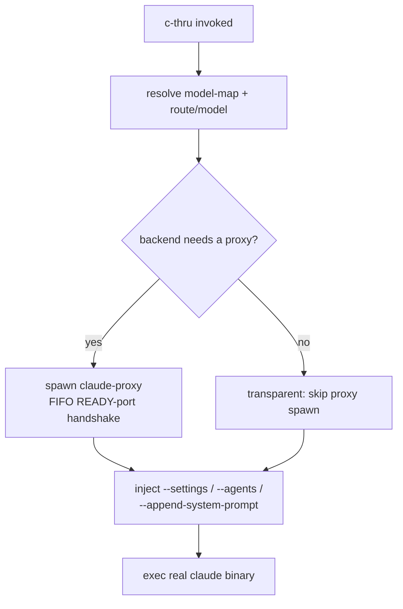
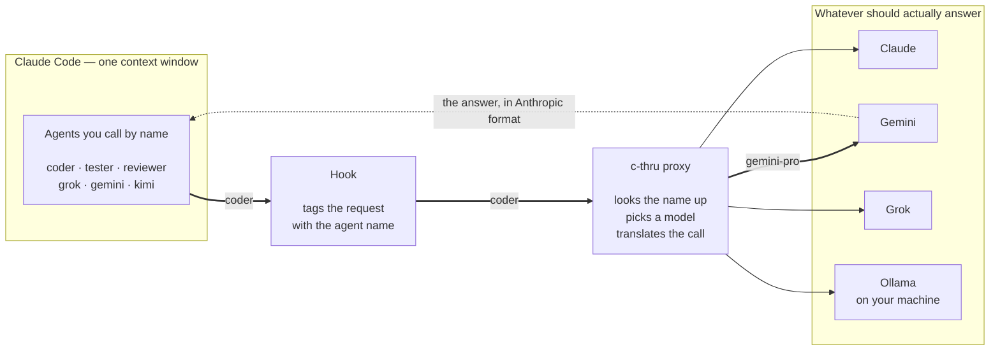
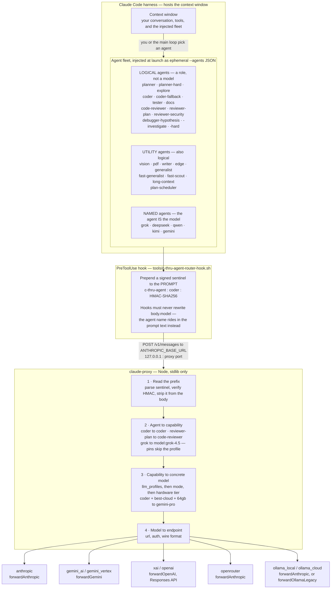
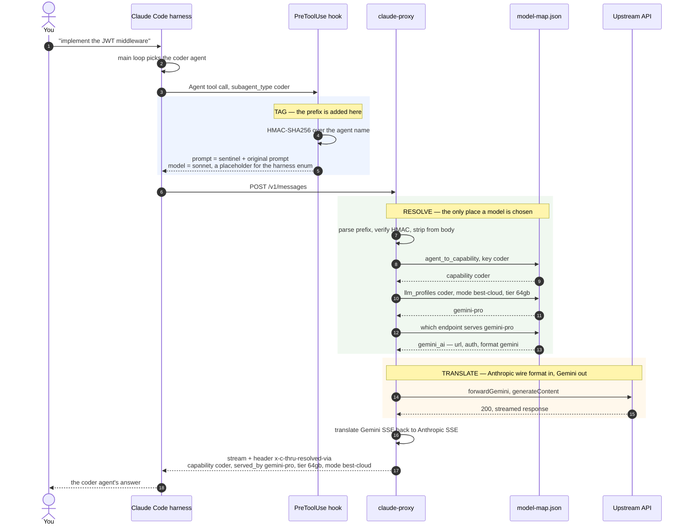
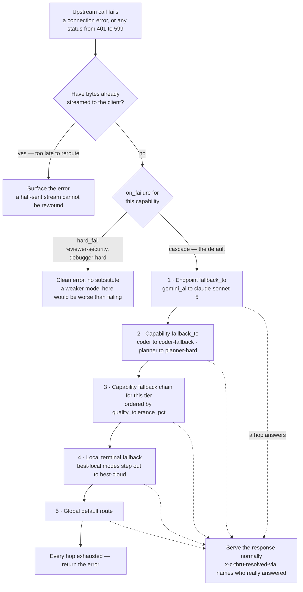
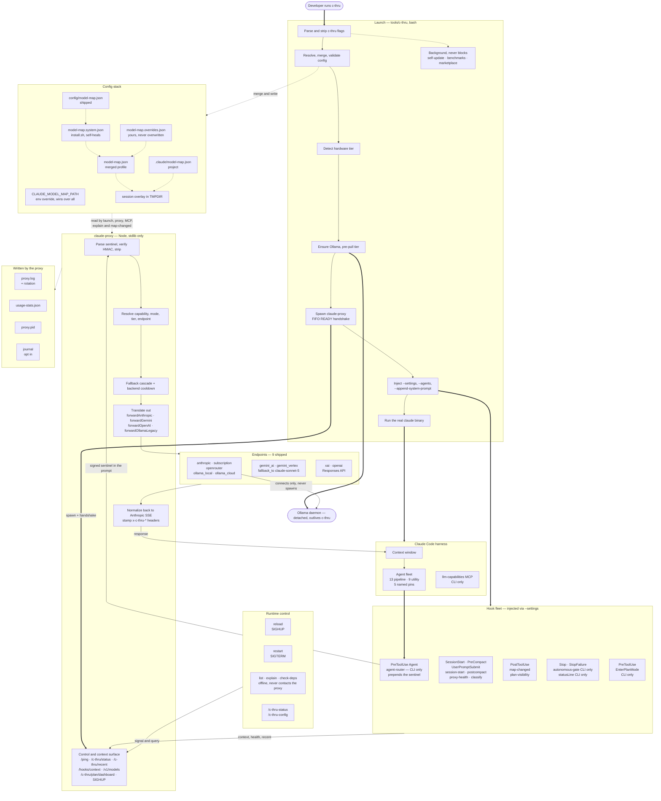

# c-thru

**A transparent router between Claude Code and the models you actually want —
without patching the vendor CLI.**

```text
Claude Code  ──▶  c-thru  ──▶  Anthropic · Ollama · Gemini · xAI · OpenRouter · …
                    │
          capability × hardware tier × mode
```

| See | Choose | Route |
|---|---|---|
| Unmodified Claude Code | Connectivity mode + RAM tier | Concrete model, translated only when needed |

Requests resolve by **capability**, **hardware tier**, and **connectivity mode**. Wire formats are translated only when the backend requires it.

### Capabilities

- Route Anthropic-shaped traffic to local and cloud backends
- Resolve models per role, tier, and mode
- Mix providers in a single session
- Fall back and reload without restarting Claude
- Observe every decision (`x-c-thru-*`, optional journal)
- Optional 27-agent fleet and `/cplan` waves (CLI install)

### In practice

```bash
cthru --mode best-local-oss     # air-gapped / local Ollama
cthru --mode best-cloud-oss     # cost-aware default
# CLI fleet: /cplan "add JWT auth"
# Or: "ask agent grok to critique this plan"
```

---

## Quick start (Shape C)

c-thru is a **CLI launcher** (`cthru`) that wraps the real `claude` binary with
routing and agent fleet inject. The **private marketplace plugin** discovers and
**bootstraps** that CLI (symlinks under `~/.claude/tools`). Product code lives
only in this repository; catalogs point at `plugins/c-thru`.

**Pick exactly one** marketplace identity. Installing both `c-thru@c-thru` and
`c-thru@claude-craft` activates the plugin twice and double-fires its hooks.

### 1. Install from private marketplace

```
/plugin marketplace add whichguy/c-thru
/plugin install c-thru@c-thru
```

(Family catalog, same package: `whichguy/claude-craft` → `c-thru@claude-craft`.)

### 2. First Claude session bootstraps CLI tools

SessionStart clones/updates `~/.claude/c-thru-src` if needed, symlinks
`c-thru` / `cthru` into `~/.claude/tools`, and seeds the model-map. Open a new
shell (or source your rc) so PATH picks up `~/.claude/tools`.

### 3. Runtime — always use `cthru`

```bash
cthru
cthru --mode best-cloud-oss
```

Plain `claude` is not the full product (no launch-time `--agents` / fleet inject).

### Developer path (clone)

```bash
git clone https://github.com/whichguy/c-thru.git
cd c-thru
bash install.sh
cthru
```

`install.sh` and plugin bootstrap share the same symlink core.

Team repos can prompt the catalog via `extraKnownMarketplaces` — see
[`docs/marketplace-release.md`](docs/marketplace-release.md). Safety / remove:
[SECURITY.md](SECURITY.md). Plugin vs CLI details:
[Appendix C](#appendix-c-plugin-vs-cli--entry-points).

### Removing c-thru

Order matters (plugin uninstall alone does not scrub global settings):

1. `pkill -f claude-proxy` — required; an orphan proxy can mask a dead base URL
2. `bash uninstall.sh` (CLI) — removes tools symlinks and loopback `ANTHROPIC_BASE_URL`
3. `/plugin uninstall c-thru@c-thru` (or the family identity)

### Cloud backends (optional)

Local-only routing needs no cloud keys. Subscription-backed Claude: see
[`docs/subscription-auth.md`](docs/subscription-auth.md).

Optional environment variables (set values in your shell profile — do not commit keys):

- `ANTHROPIC_API_KEY`
- `OPENROUTER_API_KEY`
- `GOOGLE_API_KEY` — Gemini AI Studio
- `XAI_API_KEY` — Grok routes

Full list: [`docs/env-vars.md`](docs/env-vars.md).

---

## How c-thru works

The bash entrypoint selects a model-map and routing mode, spawns the Node proxy (unless
`CLAUDE_PROXY_BYPASS=1` is set), and execs the real `claude` binary with ephemeral session
injection. The proxy translates Anthropic ↔ Gemini / Ollama and forwards everything else; agent
files declare logical capability names (`planner`, `coder`, ...) that the proxy resolves to
concrete models at request time.

<!-- BEGIN shared-diagram:launch-flow -->

```mermaid
flowchart TD
    A[c-thru invoked] --> B[resolve model-map + route/model]
    B --> C{backend needs a proxy?}
    C -- yes --> D[spawn claude-proxy<br/>FIFO READY-port handshake]
    C -- no --> E[transparent: skip proxy spawn]
    D --> F[inject --settings / --agents /<br/>--append-system-prompt]
    E --> F
    F --> G[exec real claude binary]
```
<!-- END shared-diagram:launch-flow -->

Full flow with every branch (native-subcommand bypass, `--bypass-proxy`, backend lookup ladder,
FIFO handshake failure modes): [docs/architecture-diagrams.md § 1](docs/architecture-diagrams.md#1-cli-launch--proxy-spawn--claude-exec).

claude-proxy (Node.js, stdlib only):
  - resolves capability alias → llm_profiles[capability][mode][tier] → concrete model
  - rewrites: model field, URL/Host, auth headers, model_overrides, @sigil
  - translates Anthropic ↔ Gemini and OpenAI-compatible Responses (OpenAI/xAI Responses translator)
  - forwards Ollama via /v1/messages (Ollama 0.4+) — preserves tool_use, thinking
  - catch-all passthrough for anything not explicitly handled
  - stamps x-c-thru-* response headers (resolved-via, translation-gap, …)

> The `--settings`, `--agents`, and `--append-system-prompt` injections only happen on the CLI install path. Plugin users get the proxy and `ANTHROPIC_BASE_URL` registration only — agent files and the `llm-capabilities` MCP are not loaded that way.

Two components, both in `tools/`:

- **`tools/c-thru`** (bash) — entrypoint. Config selection, Ollama lifecycle, agent injection, exec into claude.
- **`tools/claude-proxy`** (Node.js) — long-running HTTP server. Capability resolution, auth, fallback chains, SIGHUP reload, translation. **No external Node deps** — stdlib only.

> Translation gaps surface via `x-c-thru-translation-gap`. Full matrix: [`docs/anthropic-api-coverage.md`](docs/anthropic-api-coverage.md).

---

## Architecture: how a prompt becomes a model call

**The short version.** You call an agent by name. A hook tags the request with that name. The proxy
looks the name up, decides which model should serve it, and translates the call. The answer comes
back in Anthropic format, so nothing downstream needs to know where it came from.


```mermaid
flowchart LR
    subgraph CC["Claude Code — one context window"]
        AGENTS["Agents you call by name<br/><br/>coder · tester · reviewer<br/>grok · gemini · kimi"]
    end

    HOOK["Hook<br/><br/>tags the request<br/>with the agent name"]

    PROXY["c-thru proxy<br/><br/>looks the name up<br/>picks a model<br/>translates the call"]

    subgraph MODELS["Whatever should actually answer"]
        M1["Claude"]
        M2["Gemini"]
        M3["Grok"]
        M4["Ollama<br/>on your machine"]
    end

    AGENTS -->|"coder"| HOOK
    HOOK -->|"coder"| PROXY
    PROXY -->|"gemini-pro"| M2
    PROXY --> M1
    PROXY --> M3
    PROXY --> M4
    M2 -.->|"the answer, in Anthropic format"| AGENTS

    linkStyle 0,1,2 stroke-width:2.5px
```

The bold path is one real request under the shipped config: you ask for `coder`, and Gemini answers.

Two things in that picture carry the whole design. **Most agent names are roles, not models** —
`coder` says what the job is; which model serves it is decided at request time. And **the name is
the only thing that has to travel**, which is what lets a hook do the tagging while the proxy stays
the single place a model is ever chosen.

Four views add the detail. **View 1** is the map of the hot path. **View 2** walks a single request
end to end. **View 3** shows what happens when the chosen backend fails. **View 4** is the complete
component map — every box and every arrow, including the launch, config, hook and control planes
that the first three deliberately leave out.

Views 1–3 follow the same request as the picture above — the `coder` agent under the default
shipped config — so the names line up across every diagram.

> **The same material exists in both formats.** Everything is on this page, including a
> click-to-expand step-through under View 2. [`docs/request-flow.html`](docs/request-flow.html) is a
> self-contained interactive version of the same content — arrow-key stepping, a play button, and
> the component map — with no external dependencies. Open it in any browser.

### View 1 — the whole picture


```mermaid
flowchart TB
    subgraph HARNESS["Claude Code harness — hosts the context window"]
        CTX["Context window<br/>your conversation, tools, and the injected fleet"]

        subgraph FLEET["Agent fleet, injected at launch as ephemeral --agents JSON"]
            LOGICAL["LOGICAL agents — a role, not a model<br/>planner · planner-hard · explore<br/>coder · coder-fallback · tester · docs<br/>code-reviewer · reviewer-plan · reviewer-security<br/>debugger-hypothesis · -investigate · -hard"]
            UTILITY["UTILITY agents — also logical<br/>vision · pdf · writer · edge · generalist<br/>fast-generalist · fast-scout · long-context<br/>plan-scheduler"]
            NAMED["NAMED agents — the agent IS the model<br/>grok · deepseek · qwen · kimi · gemini"]
        end

        CTX -->|"you or the main loop pick an agent"| FLEET
    end

    FLEET --> HOOK

    subgraph HOOKBOX["PreToolUse hook — tools/c-thru-agent-router-hook.sh"]
        HOOK["Prepend a signed sentinel to the PROMPT<br/>c-thru-agent : coder : HMAC-SHA256<br/><br/>Hooks must never rewrite body.model —<br/>the agent name rides in the prompt text instead"]
    end

    HOOK -->|"POST /v1/messages to ANTHROPIC_BASE_URL<br/>127.0.0.1 : proxy port"| PROXYBOX

    subgraph PROXYBOX["claude-proxy — Node, stdlib only"]
        P1["1 · Read the prefix<br/>parse sentinel, verify HMAC, strip it from the body"]
        P2["2 · Agent to capability<br/>coder to coder · reviewer-plan to code-reviewer<br/>grok to model:grok-4.5 — pins skip the profile"]
        P3["3 · Capability to concrete model<br/>llm_profiles, then mode, then hardware tier<br/>coder + best-cloud + 64gb to gemini-pro"]
        P4["4 · Model to endpoint<br/>url, auth, wire format"]
        P1 --> P2 --> P3 --> P4
    end

    P4 --> ANT["anthropic<br/>forwardAnthropic"]
    P4 --> GEM["gemini_ai / gemini_vertex<br/>forwardGemini"]
    P4 --> XAI["xai / openai<br/>forwardOpenAI, Responses API"]
    P4 --> ORT["openrouter<br/>forwardAnthropic"]
    P4 --> OLL["ollama_local / ollama_cloud<br/>forwardAnthropic, or forwardOllamaLegacy"]
```

**The one idea worth internalizing:** most agents name a *job*, not a model. `coder` is a role. Which
model actually serves it is a runtime decision made by the proxy from three inputs — the capability,
the [routing mode](#routing-modes), and the detected hardware tier. Swapping a model is a one-value
edit in `config/model-map.json`; **agent files are never touched.**

The five named agents (`grok`, `deepseek`, `qwen`, `kimi`, `gemini`) are the deliberate exception:
they map to a `model:` pin and bypass capability resolution entirely, so "ask agent grok" always
reaches Grok.

**How the agent name survives the trip.** Claude Code validates the Agent tool's `model` field
against a fixed enum (`sonnet` / `opus` / `haiku` / `fable`), and c-thru's own rule forbids hooks from
rewriting `body.model` — a second rewriting path would silently drift from `config/model-map.json`.
So the hook does something narrower: it prepends a signed marker to the *prompt text*. The proxy
reads that prefix off the first message, verifies the HMAC against a `0600` secret at
`~/.claude/proxy.agent-token`, strips it, and only then decides which API to call. The model field
stays untouched end to end; **the proxy is the only component that picks a model.**

### View 2 — step-through of one request


```mermaid
sequenceDiagram
    autonumber
    actor You
    participant CC as Claude Code harness
    participant Hook as PreToolUse hook
    participant Proxy as claude-proxy
    participant Map as model-map.json
    participant Up as Upstream API

    You->>CC: "implement the JWT middleware"
    CC->>CC: main loop picks the coder agent
    CC->>Hook: Agent tool call, subagent_type coder

    rect rgb(238, 244, 255)
    Note over Hook: TAG — the prefix is added here
    Hook->>Hook: HMAC-SHA256 over the agent name
    Hook-->>CC: prompt = sentinel + original prompt<br/>model = sonnet, a placeholder for the harness enum
    end

    CC->>Proxy: POST /v1/messages

    rect rgb(240, 248, 240)
    Note over Proxy,Map: RESOLVE — the only place a model is chosen
    Proxy->>Proxy: parse prefix, verify HMAC, strip from body
    Proxy->>Map: agent_to_capability, key coder
    Map-->>Proxy: capability coder
    Proxy->>Map: llm_profiles coder, mode best-cloud, tier 64gb
    Map-->>Proxy: gemini-pro
    Proxy->>Map: which endpoint serves gemini-pro
    Map-->>Proxy: gemini_ai — url, auth, format gemini
    end

    rect rgb(255, 248, 236)
    Note over Proxy,Up: TRANSLATE — Anthropic wire format in, Gemini out
    Proxy->>Up: forwardGemini, generateContent
    Up-->>Proxy: 200, streamed response
    end

    Proxy->>Proxy: translate Gemini SSE back to Anthropic SSE
    Proxy-->>CC: stream + header x-c-thru-resolved-via<br/>capability coder, served_by gemini-pro, tier 64gb, mode best-cloud
    CC-->>You: the coder agent's answer
```

The response leg is not a mirror image. Going out, c-thru **resolves**; coming back, it **normalizes**
— Gemini or OpenAI-shaped responses are translated into Anthropic SSE so the harness never learns it
was talking to anything else. Two observability details ride along: `x-c-thru-resolved-via` names who
actually served the request, and because headers cannot be set once streaming has begun, Gemini
thinking-token counts arrive as a custom `c-thru-thinking-tokens` SSE event rather than a header.

That header is the honest answer to "which model actually ran?" — see
[Verifying which agent ran](#verifying-which-agent-ran).

#### Step-through, without leaving the README

The interactive page is nicer to click through, but nothing in it is exclusive to it. Every step
below expands in place, and the payload is shown exactly as it looks at that moment. Lines marked
`+` are what changed since the previous step.

<details>
<summary><b>Happy path — coder, best-cloud, 64gb</b> &mdash; 10 steps</summary>

<details>
<summary>1 &middot; A prompt arrives &mdash; <i>You</i></summary>

Nothing about routing has happened yet. This is an ordinary turn in an ordinary context window.

```text
# What you typed
implement the JWT middleware
```

</details>

<details>
<summary>2 &middot; The main loop picks an agent &mdash; <i>Claude Code harness</i></summary>

The fleet was injected at launch as ephemeral --agents JSON. The main loop selects coder — a role, not a model. Nothing here knows which vendor will serve it.

```diff
  # Agent tool call
  {
+   "subagent_type": "coder",
    "prompt": "implement the JWT middleware"
  }
```

</details>

<details>
<summary>3 &middot; The hook tags the prompt &mdash; <i>PreToolUse hook</i></summary>

This is the whole trick. Claude Code validates the Agent tool's model field against a fixed enum, and c-thru forbids hooks from rewriting body.model — a second rewriting path would drift from model-map.json. So the hook prepends a signed marker to the prompt text instead.

```diff
  # Prompt after the hook rewrites it
+ [[c-thru-agent:coder:9f3c1ab8...]]
  
  implement the JWT middleware
```

> model is set to "sonnet" purely to satisfy the harness enum. It is a placeholder, not a routing decision.

</details>

<details>
<summary>4 &middot; The proxy reads the prefix &mdash; <i>claude-proxy</i></summary>

ANTHROPIC_BASE_URL points at the local proxy, so the subagent's request lands here. The proxy parses the sentinel, verifies the HMAC against a 0600 secret at ~/.claude/proxy.agent-token, and strips it back out of the body.

```text
# Recovered identity
agent      coder
signature  verified
body       sentinel removed — the model never sees it
```

</details>

<details>
<summary>5 &middot; Agent → capability &mdash; <i>claude-proxy</i></summary>

Most agents map to a capability of the same name. Two alias deliberately: reviewer-plan → code-reviewer, plan-scheduler → fast-generalist.

```diff
  # config/model-map.json
  "agent_to_capability": {
+   "coder": "coder",
    "reviewer-plan": "code-reviewer",
    "plan-scheduler": "fast-generalist"
  }
```

</details>

<details>
<summary>6 &middot; Capability → concrete model &mdash; <i>claude-proxy</i></summary>

Three inputs decide it: the capability, the routing mode, and the detected hardware tier. This is the only place in the system where a model gets chosen.

```diff
  # llm_profiles.coder
  "coder": {
    "best-cloud": {
+     "64gb": "gemini-pro"
    },
    "best-cloud-oss": {
      "64gb": "kimi-k2.7-code:cloud"
    }
  }
```

</details>

<details>
<summary>7 &middot; Model → endpoint &mdash; <i>claude-proxy</i></summary>

The concrete model resolves to an endpoint entry carrying the URL, the auth scheme, and the wire format. Format picks the translator.

```diff
  # endpoints.gemini_ai — verbatim from the shipped config
  {
    "url": "https://generativelanguage.googleapis.com",
    "format": "gemini",
+   "fallback_to": "claude-sonnet-5"
  }
```

> Auth is not in this entry — it is derived from the hostname. Note the fallback_to line: it does nothing today, and everything in the failover scenario.

</details>

<details>
<summary>8 &middot; Translate and send &mdash; <i>Upstream API</i></summary>

The request arrived in Anthropic wire format. forwardGemini rewrites it into a Gemini generateContent call: system prompt, tool schemas, and content blocks all get remapped.

```diff
  # Outbound
  POST  generativelanguage.googleapis.com
        /v1beta/models/gemini-pro:streamGenerateContent
+ via   forwardGemini()
```

</details>

<details>
<summary>9 &middot; Normalize the response &mdash; <i>claude-proxy</i></summary>

Coming back, the proxy does the inverse: Gemini SSE is translated into Anthropic SSE, so the harness never learns it was talking to anything else. Because headers cannot be set once streaming has begun, Gemini thinking-token counts ride along as a custom SSE event instead.

```diff
  # Response headers
+ x-c-thru-resolved-via: {"capability":"coder",
+   "served_by":"gemini-pro","tier":"64gb",
+   "mode":"best-cloud"}
  event: c-thru-thinking-tokens
```

</details>

<details>
<summary>10 &middot; The answer lands &mdash; <i>You</i></summary>

The subagent got a normal Anthropic-shaped response. It never knew it was served by Gemini — and it did not have to.

```text
# How to check after the fact
x-c-thru-resolved-via  →  served_by: gemini-pro
```

</details>

</details>

<details>
<summary><b>Backend failure — the cascade in payloads</b> &mdash; 8 steps</summary>

<details>
<summary>1 &middot; Same request, up to the send &mdash; <i>claude-proxy</i></summary>

Steps 1 through 7 are identical to the happy path: coder → capability coder → gemini-pro → the gemini_ai endpoint. We rejoin the story at the moment of the outbound call.

```diff
  # endpoints.gemini_ai — verbatim from the shipped config
  {
    "url": "https://generativelanguage.googleapis.com",
    "format": "gemini",
+   "fallback_to": "claude-sonnet-5"
  }
```

</details>

<details>
<summary>2 &middot; The backend fails &mdash; <i>Upstream API</i></summary>

Gemini returns a 503. In a system without indirection this is where the subagent gets an error and the turn dies.

```diff
  # Upstream response
+ HTTP/1.1 503 Service Unavailable
```

</details>

<details>
<summary>3 &middot; Guard one — has anything streamed yet? &mdash; <i>Upstream API</i></summary>

The proxy checks whether bytes have already gone back to the client. A half-sent stream cannot be rewound, so mid-stream failures surface rather than reroute. Here nothing has been sent, so failover is still on the table.

```text
# Guard
res.headersSent  →  false   (safe to reroute)
```

</details>

<details>
<summary>4 &middot; Guard two — is this capability allowed to degrade? &mdash; <i>Upstream API</i></summary>

reviewer-security and debugger-hard ship with on_failure: hard_fail. For a security review, a quietly-substituted weaker model is a worse outcome than a visible failure, so those skip the cascade entirely. coder is cascade, the default.

```diff
  # llm_profiles.coder
+ "on_failure": "cascade"
  "fallback_to": "coder-fallback"
```

> A 400 would not reach this point at all — a malformed request fails the same way on every backend, so retrying would only multiply the error.

</details>

<details>
<summary>5 &middot; Stage 1 — endpoint fallback_to &mdash; <i>claude-proxy</i></summary>

The first cascade stage reads fallback_to off the failed endpoint and re-resolves from scratch. This hop crosses vendors, not just models — which is only possible because the proxy owns translation in both directions.

```diff
  # Re-resolution
  gemini_ai.fallback_to  →  claude-sonnet-5
+ endpoint               →  anthropic
+ wire format            →  forwardAnthropic
```

</details>

<details>
<summary>6 &middot; Retry against Anthropic &mdash; <i>Upstream API</i></summary>

The same original request — sentinel already stripped, content untouched — is sent to a completely different provider in a completely different wire format.

```diff
  # Outbound, second attempt
+ POST api.anthropic.com/v1/messages
       model: claude-sonnet-5
+ HTTP/1.1 200 OK
```

</details>

<details>
<summary>7 &middot; Later stages, if that had failed too &mdash; <i>claude-proxy</i></summary>

Stage 1 answered, so the cascade stops. Had it not, the proxy would keep walking: capability fallback_to, then the tier's fallback chain ordered by quality tolerance, then local modes stepping out to cloud, then the global default route.

```text
# The full cascade order
1  endpoint fallback_to        ← answered here
2  capability fallback_to      coder → coder-fallback
3  capability fallback chain   by quality_tolerance_pct
4  local terminal fallback     best-local → best-cloud
5  global default route
```

</details>

<details>
<summary>8 &middot; The subagent never saw the failure &mdash; <i>You</i></summary>

It asked for coder. It never asked for Gemini. The only trace that anything went sideways is the resolved-via header naming a different model than the happy path.

```diff
  # Response header
  x-c-thru-resolved-via: {"capability":"coder",
+   "served_by":"claude-sonnet-5",
    "mode":"best-cloud"}
```

</details>

</details>

<details>
<summary><b>Named agent — ask agent grok</b> &mdash; 6 steps</summary>

<details>
<summary>1 &middot; You name a model, not a job &mdash; <i>Claude Code harness</i></summary>

Five agents are the deliberate exception to the whole capability scheme: grok, deepseek, qwen, kimi and gemini. Asking for grok means you want Grok specifically — a second opinion from a different vendor is the entire point.

```text
# What you typed
ask agent grok to critique this plan
```

</details>

<details>
<summary>2 &middot; The hook tags it exactly the same way &mdash; <i>PreToolUse hook</i></summary>

No special case here. The hook does not know or care whether the agent is logical or pinned; it prepends the same signed marker.

```diff
  # Prompt after the hook
+ [[c-thru-agent:grok:41d7e0c2...]]
  
  critique this plan
```

</details>

<details>
<summary>3 &middot; The lookup returns a pin, not a capability &mdash; <i>claude-proxy</i></summary>

This is where the two kinds of agent diverge. A model: prefix in agent_to_capability tells the proxy to skip capability resolution entirely and resolve the pinned model directly.

```diff
  # config/model-map.json
  "agent_to_capability": {
    "coder": "coder",
+   "grok": "model:grok-4.5",
+   "gemini": "model:gemini-pro",
+   "kimi": "model:kimi-k2.7-code:cloud"
  }
```

</details>

<details>
<summary>4 &middot; Straight to the endpoint &mdash; <i>claude-proxy</i></summary>

No llm_profiles lookup, no mode, no hardware tier. Those three inputs are exactly what a pin opts out of — which is why grok reaches Grok no matter how the rest of the fleet is configured.

```diff
  # Resolution, short-circuited
  grok-4.5  →  endpoints.xai
+ mode and tier are not consulted
```

</details>

<details>
<summary>5 &middot; Translate to the Responses API &mdash; <i>Upstream API</i></summary>

xAI speaks the OpenAI-compatible Responses format, so forwardOpenAI handles the translation. Different vendor, different wire format, same Anthropic-shaped request on the way in.

```diff
  # Outbound
  POST api.x.ai/v1/responses
+ via  forwardOpenAI()
```

</details>

<details>
<summary>6 &middot; Same normalized response &mdash; <i>You</i></summary>

The answer comes back through the same translation layer as every other route. The pin changed which model answered — not how anything downstream works.

```text
# Response header
x-c-thru-resolved-via: {"served_by":"grok-4.5"}
```

</details>

</details>

### View 3 — when a backend fails

Failover is the reason the indirection earns its keep. The client asked for `coder`; it never asked
for Gemini, so the proxy is free to serve `coder` from somewhere else.


```mermaid
flowchart TD
    START["Upstream call fails<br/>a connection error, or any status from 401 to 599"] --> WINDOW

    WINDOW{"Have bytes already<br/>streamed to the client?"}
    WINDOW -->|"yes — too late to reroute"| SURFACE["Surface the error<br/>a half-sent stream cannot be rewound"]
    WINDOW -->|"no"| GATE

    GATE{"on_failure for<br/>this capability"}
    GATE -->|"hard_fail<br/>reviewer-security, debugger-hard"| STOP["Clean error, no substitute<br/>a weaker model here would be worse than failing"]
    GATE -->|"cascade — the default"| S1

    S1["1 · Endpoint fallback_to<br/>gemini_ai to claude-sonnet-5"] --> S2
    S2["2 · Capability fallback_to<br/>coder to coder-fallback · planner to planner-hard"] --> S3
    S3["3 · Capability fallback chain for this tier<br/>ordered by quality_tolerance_pct"] --> S4
    S4["4 · Local terminal fallback<br/>best-local modes step out to best-cloud"] --> S5
    S5["5 · Global default route"] --> EXHAUST["Every hop exhausted — return the error"]

    S1 -.->|"a hop answers"| OK
    S2 -.-> OK
    S3 -.-> OK
    S4 -.-> OK
    S5 -.-> OK

    OK["Serve the response normally<br/>x-c-thru-resolved-via names who really answered"]
```

Walking the shipped config for our example: `coder` resolves to `gemini-pro` on the `gemini_ai`
endpoint. If Gemini 500s, stage 1 fires — `endpoints.gemini_ai.fallback_to` is `claude-sonnet-5` — and
the same request is transparently re-sent to Anthropic. The subagent never sees an error; only
`x-c-thru-resolved-via` records that `served_by` changed.

Three properties are worth calling out, because they are what make this safe rather than merely
clever:

- **Failover crosses vendors, not just models.** Stage 1 hops to a different provider, wire format
  and all. That is only possible because the proxy owns translation.
- **A 400 is not retried.** Malformed requests fail the same way on every backend, so retrying would
  just multiply the error. The rule is a single exclusion rather than a list: `400` never cascades,
  and every other status from `401` to `599` does — as do connection errors and timeouts.
- **Some capabilities refuse to degrade.** `reviewer-security` and `debugger-hard` ship with
  `on_failure: "hard_fail"`. For a security review, a quietly-substituted weaker model is a worse
  outcome than a visible failure, so the cascade is skipped entirely.

Every branch and guard, with source anchors:
[docs/architecture-diagrams.md § 2](docs/architecture-diagrams.md#2-model-resolution--fallback-cascade).

### View 4 — every box and every arrow

The first three views follow one request. This one is the whole system: what runs at launch, where
config comes from, every hook, what the proxy serves besides `/v1/messages`, and what writes which
file.

Read the arrows by weight:

| Arrow | Means |
|---|---|
| **Thick** | the launch sequence — what `c-thru` does before your first prompt |
| **Solid** | the live request and response path |
| **Dotted** | a read, an observation, or a file write |

The spine runs **launch → config → proxy → endpoints**, with the harness and its hook fleet on the
right and the artifacts, control surface and Ollama daemon hanging off the sides.


```mermaid
flowchart TB
    DEV(["Developer runs c-thru"])

    subgraph L["Launch — tools/c-thru, bash"]
        direction TB
        L1["Parse and strip c-thru flags"]
        L2["Resolve, merge, validate config"]
        L3["Detect hardware tier"]
        L4["Ensure Ollama, pre-pull tier"]
        L5["Spawn claude-proxy<br/>FIFO READY handshake"]
        L6["Inject --settings, --agents,<br/>--append-system-prompt"]
        L7["Run the real claude binary"]
        BG["Background, never blocks<br/>self-update · benchmarks · marketplace"]
        L1 --> L2 --> L3 --> L4 --> L5 --> L6 --> L7
        L1 -.-> BG
    end

    subgraph H["Claude Code harness"]
        direction LR
        CTX["Context window"]
        AG["Agent fleet<br/>13 pipeline · 9 utility<br/>5 named pins"]
        MCP["llm-capabilities MCP<br/>CLI only"]
        CTX --> AG
    end

    subgraph HK["Hook fleet — injected via --settings"]
        direction LR
        H4["PreToolUse Agent<br/>agent-router — CLI only<br/>prepends the sentinel"]
        H1["SessionStart · PreCompact<br/>UserPromptSubmit<br/>session-start · postcompact<br/>proxy-health · classify"]
        H6["PostToolUse<br/>map-changed<br/>plan-visibility"]
        H8["Stop · StopFailure<br/>autonomous-gate CLI only<br/>statusLine CLI only"]
        H5["PreToolUse<br/>EnterPlanMode<br/>CLI only"]
    end

    subgraph P["claude-proxy — Node, stdlib only"]
        direction TB
        PR1["Parse sentinel, verify HMAC, strip"]
        PR2["Resolve capability, mode, tier, endpoint"]
        PR3["Fallback cascade + backend cooldown"]
        PR4["Translate out<br/>forwardAnthropic · forwardGemini<br/>forwardOpenAI · forwardOllamaLegacy"]
        PR5["Normalize back to Anthropic SSE<br/>stamp x-c-thru-* headers"]
        SVC["Control and context surface<br/>/ping · /c-thru/status · /c-thru/recent<br/>/hooks/context · /v1/models<br/>/c-thru/plan/dashboard · SIGHUP"]
        PR1 --> PR2 --> PR3 --> PR4
    end

    subgraph B["Endpoints — 9 shipped"]
        direction LR
        E1["anthropic · subscription<br/>openrouter<br/>ollama_local · ollama_cloud"]
        E2["gemini_ai · gemini_vertex<br/>fallback_to claude-sonnet-5"]
        E3["xai · openai<br/>Responses API"]
    end

    OLLAMA(["Ollama daemon — detached, outlives c-thru"])

    subgraph CFG["Config stack"]
        direction TB
        C7["CLAUDE_MODEL_MAP_PATH<br/>env override, wins over all"]
        C1["config/model-map.json<br/>shipped"]
        C2["model-map.system.json<br/>install.sh, self-heals"]
        C3["model-map.overrides.json<br/>yours, never overwritten"]
        C4["model-map.json<br/>merged profile"]
        C5[".claude/model-map.json<br/>project"]
        C6["session overlay in TMPDIR"]
        C1 -.-> C2 -.-> C4
        C3 -.-> C4
        C4 -.-> C6
        C5 -.-> C6
    end

    subgraph ART["Written by the proxy"]
        direction LR
        A1["proxy.log<br/>+ rotation"]
        A2["usage-stats.json"]
        A3["proxy.pid"]
        A4["journal<br/>opt in"]
    end

    subgraph CTL["Runtime control"]
        direction LR
        T1["reload<br/>SIGHUP"]
        T2["restart<br/>SIGTERM"]
        T3["list · explain · check-deps<br/>offline, never contacts the proxy"]
        T4["/c-thru-status<br/>/c-thru-config"]
    end

    DEV ==> L1
    L7 ==> H
    L6 ==> HK
    L5 ==>|"spawn + handshake"| SVC
    AG ==> H4
    H4 -->|"signed sentinel in the prompt"| PR1
    HK -->|"context, health, recent"| SVC
    PR4 --> B
    B --> PR5
    PR5 -->|"response"| CTX
    L4 ==> OLLAMA
    E1 -->|"connects only, never spawns"| OLLAMA
    CFG -.->|"read by launch, proxy, MCP,<br/>explain and map-changed"| P
    L2 -.->|"merge and write"| CFG
    P -.-> ART
    CTL -->|"signal and query"| SVC
```

A few relationships in there are worth stating outright, because they are the ones people get wrong:

- **`c-thru` starts Ollama; the proxy never does.** The bash entrypoint owns daemon lifecycle and
  `nohup`s it detached, so Ollama outlives the session. `claude-proxy` only ever connects to it.
- **Config is read at startup, not per request.** The proxy re-reads only on `SIGHUP` — which is
  exactly what `c-thru reload` sends, and why editing the map does not require a restart.
- **`c-thru list`, `explain` and `check-deps` never touch the proxy.** They resolve straight from
  config, so you can ask "why would it pick that?" with nothing running.
- **Not every hook ships on both install paths.** The agent-router hook, the plan-mode hint, the
  autonomous gate, the statusline and the MCP server are CLI-only; the other eight also ship in the
  plugin bundle. Routing by agent name is therefore a CLI-install feature.

---

## Routing modes

Set with `CLAUDE_LLM_MODE` (or `--mode <name>` on the CLI):

| Mode | Description |
|---|---|
| `best-cloud` | Anthropic + Gemini cloud; local fallback at 64 GB+ |
| `best-cloud-oss` | **Default.** Cloud OSS (DeepSeek, Kimi, GLM via `*:cloud` / OpenRouter) |
| `best-local-oss` | Fully local (Phi, Qwen, Devstral) |
| `best-cloud-gov` | US-Gov compliant cloud (non-Chinese-origin) |
| `best-local-gov` | US-Gov compliant local |

Hardware tier is auto-detected from `os.totalmem()`; override with `CLAUDE_LLM_PROFILE` (or `--profile <tier>`): `16gb` / `32gb` / `48gb` / `64gb` / `128gb`.

---

---

## Use cases

What c-thru is *for* — the scenarios the router/proxy/fleet exist to serve. Each maps to a [routing mode](#routing-modes) and exercises a representative slice of the [agent fleet](#agents); the [Agent routing reference](#agent-routing-reference) shows exactly which model each agent lands on.

| # | Use case | Mode(s) | Representative agents |
|---|---|---|---|
| 1 | **Fully-local / air-gapped dev** — no cloud egress; everything on local Ollama | [`best-local-oss`](#routing-modes) | `planner`, `coder`, `tester`, `docs` |
| 2 | **Cost-optimized mixed cloud** — OSS cloud for bulk work, Anthropic only for the hard tiers | [`best-cloud-oss`](#routing-modes) | `coder`, `debugger-hard`, `planner-hard` |
| 3 | **Max-quality cloud** — Opus / Sonnet / Gemini per role | [`best-cloud`](#routing-modes) | `planner-hard`, `reviewer-security`, `coder` |
| 4 | **Compliance / data-sovereignty** — Chinese-origin models filtered out | [`best-cloud-gov`](#routing-modes) / [`best-local-gov`](#routing-modes) | `planner`, `code-reviewer`, `tester` |
| 5 | **Hardware-tiered auto-scaling** — same config; `16gb`→`128gb` resolves to different concrete models | any (varies by `--profile`) | whole fleet |
| 6 | **Agentic wave planning** — `/cplan` drives a planner→coder→reviewer→tester→docs pipeline with state | any | `plan-scheduler`, `planner`, `coder`, `code-reviewer`, `tester`, `docs` |
| 7 | **Role-based model mixing in one session** — Claude plans, local Qwen codes, Gemini debugs | [`best-cloud`](#routing-modes) | `planner` (Anthropic), `coder`/`tester` (Ollama), `debugger-investigate` (Gemini) |
| 8 | **Fallback-chain resilience** — primary backend down → cascade to the next; `hard_fail` tiers opt out | any | `coder`→`coder-fallback`, `reviewer-security` (`hard_fail`) |
| 9 | **Runtime remap without restart** — edit the model-map + SIGHUP reload | any | whole fleet |
| 10 | **Observability / audit** — journaling + `x-c-thru-*` headers + usage-stats for routing forensics | any | whole fleet — see [Verifying which agent ran](#verifying-which-agent-ran) |

---

---

## Configuration

Three-tier merge for the profile graph at `~/.claude/`:

1. `model-map.system.json` — shipped defaults (overwritten on each install)
2. `model-map.overrides.json` — your customizations (created empty, never overwritten)
3. `model-map.json` — derived merge (regenerated by the proxy on startup)

A project can opt out of the global graph by placing its own `model-map.json` at `$PWD/.claude/model-map.json` — that file is selected as its own DAG rather than merged on top of the profile graph. `CLAUDE_MODEL_MAP_PATH` overrides everything.

Schema reference, route/endpoint/profile structure, and the full `model_overrides` semantics: [`CLAUDE.md`](CLAUDE.md).

---

---

## Agents

27 agents declare `model: <agent-name>` in frontmatter — including the five brand agents, whose frontmatter names themselves like every other agent. Their pin to a concrete model lives one layer down, in `agent_to_capability` (`"grok": "model:grok-4.5"`), not in the agent file. The proxy resolves
`agent-name → agent_to_capability → llm_profiles[capability][mode][tier] → concrete model`
at request time. Agent files are never edited when you remap models.

The fleet ships with the **CLI install** (it depends on `--agents` injection by `tools/c-thru`):

- **Pipeline (13):** `planner`, `planner-hard`, `explore`, `coder`, `coder-fallback`, `tester`, `docs`, `code-reviewer`, `reviewer-plan`, `reviewer-security`, `debugger-hypothesis`, `debugger-investigate`, `debugger-hard`.
- **Utility (9):** `vision`, `pdf`, `writer`, `edge`, `generalist`, `fast-generalist`, `fast-scout`, `long-context`, `plan-scheduler`.

Pipeline agents end each response with an `UNBLOCKED_TASKS` block of `Task()` calls naming the next agent(s) — the inter-agent dispatch graph is verified by `test/agent-dispatch-graph.test.js`. Full wave lifecycle and STATUS contracts: [`docs/agent-architecture.md`](docs/agent-architecture.md).

Agents are selected by matching the task against each agent's frontmatter `description`. To write one that gets picked, follow [`docs/agent-authoring.md`](docs/agent-authoring.md) (enforced by `test/agent-description-quality.test.js`).

### Agent routing reference

The full mapping, all the way through the implementation: **agent → capability → concrete model (per mode) → endpoint**. Models shown at the reference tier **`64gb`**; the columns are the three primary [routing modes](#routing-modes). The endpoint column is for `best-cloud` (**table column**; product default mode is [`best-cloud-oss`](#routing-modes)); `test/agent-mapping-complete.test.js` verifies that *every* agent resolves to a live endpoint across all 5 modes × 5 tiers, so this table can't silently drift.

> This table is **generated** from `config/model-map.json` — do not hand-edit the rows between the sentinel
> markers. Regenerate after any config bump with `make docs` (or `node tools/gen-routing-doc.js`).
> Drift is caught by `node tools/gen-routing-doc.js --check`, registered in the hermetic suite
> (`make test` / `test/run-all.sh`). See [`docs/derived-artifacts.md`](docs/derived-artifacts.md).

<!-- BEGIN routing-table (generated by tools/gen-routing-doc.js — run it, don't hand-edit) -->
| Agent | Capability | `best-cloud` | `best-cloud-oss` | `best-local-oss` | Endpoint (`best-cloud`) |
|---|---|---|---|---|---|
| `code-reviewer` | `code-reviewer` | `claude-sonnet-5` | `kimi-k2.7-code:cloud` | `qwen3.6:35b` | `anthropic` |
| `coder` | `coder` | `gemini-pro` | `kimi-k2.7-code:cloud` | `qwen3.6:35b` | `gemini_ai` |
| `coder-fallback` | `coder-fallback` | `gemini-pro-latest` | `kimi-k2.7-code:cloud` | `qwen3.6:35b` | `gemini_ai` |
| `debugger-hard` | `debugger-hard` | `claude-opus-4-8` | `kimi-k2.7-code:cloud` | `qwen3.6:35b` | `anthropic` |
| `debugger-hypothesis` | `debugger-hypothesis` | `gemini-pro` | `kimi-k2.7-code:cloud` | `qwen3.6:35b` | `gemini_ai` |
| `debugger-investigate` | `debugger-investigate` | `gemini-pro` | `kimi-k2.7-code:cloud` | `qwen3.6:35b` | `gemini_ai` |
| `deepseek` &nbsp;⚠ | `model:deepseek-v4-pro:cloud` | `—` | `—` | `—` | `—` |
| `docs` | `docs` | `gemma4:26b` | `gemma4:26b` | `qwen3.6:35b` | `ollama_local` |
| `edge` | `edge` | `gemma4:e4b` | `gemma4:e4b` | `gemma4:e4b` | `ollama_local` |
| `explore` | `explore` | `gemini-pro-latest` | `qwen3.6:35b-a3b-coding-nvfp4` | `qwen3.6:35b-a3b-coding-nvfp4` | `gemini_ai` |
| `fast-generalist` | `fast-generalist` | `gemma4:e4b` | `qwen3.6:35b` | `gemma4:e4b` | `ollama_local` |
| `fast-scout` | `fast-scout` | `phi4-mini:3.8b` | `phi4-mini:3.8b` | `phi4-mini:3.8b` | `ollama_local` |
| `gemini` &nbsp;⚠ | `model:gemini-pro` | `—` | `—` | `—` | `—` |
| `generalist` | `generalist` | `claude-sonnet-5` | `glm-5.2:cloud` | `qwen3.6:35b` | `anthropic` |
| `grok` &nbsp;⚠ | `model:grok-4.5` | `—` | `—` | `—` | `—` |
| `kimi` &nbsp;⚠ | `model:kimi-k2.7-code:cloud` | `—` | `—` | `—` | `—` |
| `long-context` | `long-context` | `claude-sonnet-5` | `deepseek-v4-pro:cloud` | `qwen3.6:35b` | `anthropic` |
| `pdf` | `pdf` | `claude-sonnet-5` | `qwen3.6:35b` | `qwen3.6:35b` | `anthropic` |
| `plan-scheduler` &nbsp;⚠ | `fast-generalist` | `gemma4:e4b` | `qwen3.6:35b` | `gemma4:e4b` | `ollama_local` |
| `planner` | `planner` | `claude-fable-5` | `deepseek-v4-pro:cloud` | `qwen3.6:35b` | `anthropic` |
| `planner-hard` | `planner-hard` | `claude-fable-5` | `deepseek-v4-pro:cloud` | `qwen3.6:35b` | `anthropic` |
| `qwen` &nbsp;⚠ | `model:qwen3.6:35b` | `—` | `—` | `—` | `—` |
| `reviewer-plan` &nbsp;⚠ | `code-reviewer` | `claude-sonnet-5` | `kimi-k2.7-code:cloud` | `qwen3.6:35b` | `anthropic` |
| `reviewer-security` | `reviewer-security` | `claude-opus-4-8` | `deepseek-v4-pro:cloud` | `qwen3.6:35b` | `anthropic` |
| `tester` | `tester` | `qwen3.6:35b-a3b-coding-nvfp4` | `qwen3.6:35b-a3b-coding-nvfp4` | `qwen3.6:35b-a3b-coding-nvfp4` | `ollama_local` |
| `vision` | `vision` | `claude-sonnet-5` | `qwen3.6:35b` | `qwen3.6:35b` | `anthropic` |
| `writer` | `writer` | `claude-sonnet-5` | `glm-5.2:cloud` | `qwen3.6:35b` | `anthropic` |
<!-- END routing-table -->

**⚠ Non-1:1 rows.** Two agents intentionally route to a *different* capability than their own name:
`reviewer-plan` → `code-reviewer` and `plan-scheduler` → `fast-generalist`. Every other agent maps 1:1.

**Utility passthroughs.** `WebSearch`, `WebFetch`, and `Monitor` are not agent files — they're tool calls mapped to `fast-scout` in `agent_to_capability` for observability only; the [router hook](#verifying-which-agent-ran) logs their capability but does **not** override their model (doing so would corrupt the tool's input).

**Gov modes.** `best-cloud-gov` / `best-local-gov` resolve through the same generic lookup as every other mode. There is **no runtime origin filter** — their `llm_profiles` cells are hand-curated to avoid Chinese-origin models (`qwen*`, `deepseek*`, `glm*`, …), so the guarantee is a config-authoring convention rather than an enforced mechanism; editing a gov cell to point at a blocked model would simply work. The one gov-aware runtime behavior is a safety net: if a config reload removes an active gov mode, the proxy degrades routing to `best-cloud` and logs `mode.orphaned_gov_degrade`, warning that gov egress restrictions are no longer enforced.

### Verifying which agent ran

"Which agent actually ran?" is observable on three surfaces — pick the cheapest for your purpose:

| Surface | Where | Carries |
|---|---|---|
| **Response headers** | `x-c-thru-resolved-via` (JSON), `x-c-thru-served-by` on every proxied response | resolved `capability`, `served_by` model, `tier`, `mode` |
| **Journal** | `~/.claude/journal/<date>/<capability>.jsonl` (opt-in: `CLAUDE_PROXY_JOURNAL=1`) | per-request `capability` + `served_by`, auth-scrubbed |
| **Usage stats** | `~/.claude/usage-stats.json` → `by_agent[name].served_by` | cumulative per-agent model + call counts |

The prompt→agent seam itself lives in `tools/c-thru-agent-router-hook.sh` (a `PreToolUse` hook): because Claude Code's Agent tool ignores the frontmatter `model:` field ([bug #44385](https://github.com/anthropics/claude-code/issues/44385)), the hook records the agent identity for the proxy. It sets `model` only to a fixed, enum-safe alias (`sonnet` by default) to satisfy Claude Code’s own validation, and carries the real agent name in an HMAC-signed sentinel prepended to the prompt text. The concrete model is chosen later, by the proxy, and only there.

Tests: `test/agent-mapping-complete.test.js`, `test/agent-invocation-headers.test.js`, `test/agent-router-hook.test.js`, optional `test/agent-scenarios-e2e.sh`. See [Appendix D](#appendix-d-tests-and-contributor-checks).


---

---

## Reliability features

- **Catch-all forwarder** — anything not explicitly translated is passed through to the configured Anthropic endpoint (or returns a structured 501 if none is configured). Long-lived SSE and slow batch endpoints have idle-timeout carve-outs.
- **`x-c-thru-translation-gap` header** — when Gemini translation drops a content-block type (`redacted_thinking`, `server_tool_use`, MCP blocks, etc.), the dropped types are surfaced on the response so callers see the loss instead of guessing.
- **`fallback_to` retry chains** — endpoint-level fallback on 5xx / 429 / network errors. Cycle detection per-request; resets on SIGHUP config reload (`CONFIG_VERSION` bump). `on_failure: "hard_fail"` opts out for security-sensitive capabilities.
- **Per-request journaling** — opt-in via `CLAUDE_PROXY_JOURNAL=1`. Writes JSONL to `~/.claude/journal/YYYY-MM-DD/<capability>.jsonl` with auth headers scrubbed. See [`docs/journaling.md`](docs/journaling.md).
- **SIGHUP-safe reload** — `c-thru reload` triggers a config re-read; read errors keep the previous live config rather than crashing.

---

---

## Further reading

- [`docs/getting-started.md`](docs/getting-started.md) — onboarding for new contributors (clone → first change → green suite)
- [`CLAUDE.md`](CLAUDE.md) — full developer reference (env vars, runtime control, model-map schema, contributor invariants)
- [`docs/anthropic-api-coverage.md`](docs/anthropic-api-coverage.md) — endpoint × backend coverage matrix, content-block sub-matrix, server-tool sub-matrix
- [`docs/openai-gap-roadmap.md`](docs/openai-gap-roadmap.md) — OpenAI / Responses-path coverage inventory and gap roadmap
- [`docs/headers.md`](docs/headers.md) — every `x-c-thru-*` response header (routing, cache, translation gaps, thinking observability, deprecation)
- [`docs/env-vars.md`](docs/env-vars.md) — full environment variable reference
- [`docs/subscription-auth.md`](docs/subscription-auth.md) — using Claude.ai subscription instead of API billing
- [`docs/request-flow.html`](docs/request-flow.html) — interactive step-through of a request: agent name → hook → proxy → model → response, plus the failover and named-pin paths and the full component map. Self-contained; open in any browser
- [`docs/architecture-diagrams.md`](docs/architecture-diagrams.md) — the six per-subsystem flow diagrams, each with file:line source anchors
- [`docs/agent-architecture.md`](docs/agent-architecture.md) — wave lifecycle, STATUS contracts, escalation chain
- [`docs/journaling.md`](docs/journaling.md) — per-request JSONL schema and storage layout

---

---

## Appendix A: CLI install (for contributors and advanced users)

The CLI install adds the `c-thru` terminal binary and the surfaces that depend on it (agent fleet, MCP server, control subcommands, flag-driven routing). Use it if you want flag-driven mode/profile selection, want to inspect resolution with `c-thru explain`, or you're contributing to the repo. First-contribution walkthrough: [`docs/getting-started.md`](docs/getting-started.md).

```bash
git clone https://github.com/whichguy/c-thru.git
cd c-thru
bash install.sh
```

(`install.sh` is invoked with `bash` so a fresh checkout works without a git executable bit.)

`install.sh` symlinks a curated tool set into `~/.claude/tools/` and seeds `~/.claude/model-map.system.json` from `config/model-map.json`. User overrides go in `~/.claude/model-map.overrides.json` and are preserved across upgrades. Full filesystem footprint: see the "Filesystem footprint" section of [`CLAUDE.md`](CLAUDE.md).

To reverse the install (overrides preserved):

```bash
bash uninstall.sh --dry-run
bash uninstall.sh
```

Verify:

```bash
~/.claude/tools/c-thru list                      # show active profile, routes, Ollama models
c-thru                                           # launch Claude Code with default routing
c-thru --mode best-local-oss                     # force fully-local Ollama routing
c-thru --mode best-cloud-oss                     # OSS cloud via OpenRouter
c-thru --route background --model gemma4:26b     # named route + explicit model
```

---

---

## Appendix B: CLI reference

`cthru` is installed as a convenience alias for `c-thru` — the two are identical (`cthru -p …` ≡ `c-thru -p …`).

| Subcommand | Effect |
|---|---|
| `c-thru list` | Active profile, routes, custom modes, Ollama models |
| `c-thru reload` | SIGHUP proxy, wait for `/ping`, print new tier |
| `c-thru restart [--force]` | Stop + re-spawn proxy |
| `c-thru explain --capability X --mode M [--tier T]` | Print resolution chain, no real request |
| `c-thru stats` / `c-thru stats clear` | Per-agent/model usage stats |
| `c-thru check-deps [--fix]` | Audit system dependencies |
| Native Claude Code subcommands (`agents`, `auth`, `auto-mode`, `doctor`, `gateway`, `install`, `mcp`/`plugin`/`plugins`, `project`, `setup-token`, `ultrareview`, `update`/`upgrade`) | Pass through untouched to the real `claude` binary |

| Flag | Sets env | Effect |
|---|---|---|
| `--route <name>` | — | Use a named route from `model-map.json` |
| `--model <name>` | — | Override model for this invocation |
| `--mode <m>` | `CLAUDE_LLM_MODE` | Routing mode |
| `--profile <t>` | `CLAUDE_LLM_PROFILE` | Force hardware tier |
| `--memory-gb <n>` | `CLAUDE_LLM_MEMORY_GB` | Override RAM detection |
| `--bypass-proxy` | `CLAUDE_PROXY_BYPASS=1` | Skip proxy entirely on the native `api.anthropic.com` path; other explicit routes fail fast because their protocol/auth/path adaptation requires the proxy |
| `--journal` | `CLAUDE_PROXY_JOURNAL=1` | Per-request journaling |
| `--proxy-debug [N]` | `CLAUDE_PROXY_DEBUG=N` | Proxy verbose logs |
| `--router-debug [N]` | `C_THRU_DEBUG=N` | Router verbose logs |
| `--no-update` | `C_THRU_NO_UPDATE=1` | Skip git self-update |

**Flag precedence**, when combined on one invocation:
1. `--model <name>` forces a concrete model for this invocation, overriding `--route` if both are passed.
2. `--route <name>` resolves to a model via `model-map.json`, used when `--model` is absent.
3. `--mode <m>` and `--profile <t>` are orthogonal — they select the hardware-tier slot the *proxy* uses to resolve capability-based routing (agents, fallbacks), independent of any explicit `--model`/`--route` pin.

Full env-var reference: [`docs/env-vars.md`](docs/env-vars.md). Runtime control details: [`CLAUDE.md`](CLAUDE.md).

---

---

## Appendix C: Plugin vs CLI + entry points

The marketplace plugin is the right starting point for most users. The CLI install path (`bash install.sh`, see [Appendix A](#appendix-a-cli-install-for-contributors-and-advanced-users)) adds a `c-thru` terminal binary and the surfaces that need it: the agent fleet, the `llm-capabilities` MCP server, runtime control subcommands, and flag-driven mode/profile selection.

| Surface | Plugin (marketplace) | CLI (`bash install.sh`) |
|---|:---:|:---:|
| `claude-proxy` runtime + auto-spawn on session start | ✓ | ✓ |
| Model-map seeding (`model-map.system.json`, overrides preserved) | ✓ | ✓ |
| `ANTHROPIC_BASE_URL` auto-registration in settings | ✓ | (set per launch) |
| Slash command `/c-thru-status` | ✓ | ✓ |
| Slash command `/cplan` (needs `planning-suite`; full 27-agent fleet is CLI inject only — see row below) | ✓ | ✓ |
| Skills `c-thru-plan`, `c-thru-config`, `c-thru-control` | ✓ | ✓ |
| User-wide hooks — fire in every Claude Code session (SessionStart, UserPromptSubmit, PostToolUse, PreCompact) | ✓ | — |
| Ephemeral hooks — injected per `c-thru` launch only (no static project `.claude` hooks) | — | ✓ |
| `c-thru` binary on PATH | — | ✓ |
| Control subcommands (`list`, `reload`, `restart`, `explain`, `stats`, `check-deps`) | — | ✓ |
| Flags (`--mode`, `--profile`, `--bypass-proxy`, `--journal`, `--router-debug`) | (use env vars) | ✓ |
| Agent fleet (27 agents) injected via `--agents` | — | ✓ |
| `llm-capabilities` MCP server injected via `--settings` | — | ✓ |
| Contributor checks (`c-thru-contract-check`, `c-thru-hygiene-check`) | — | ✓ |

Plugin hooks fire globally in every Claude Code session; the CLI injects the same shared fleet ephemerally on each `c-thru` launch (`install.sh` strips durable c-thru fleet hooks from `~/.claude/settings.json`; project `.claude/settings.json` does not register c-thru hooks). Prefer **one** of plugin vs CLI inject — both together can double-fire the same hooks.

TUI garble / input junk under c-thru: see [`docs/tui-troubleshooting.md`](docs/tui-troubleshooting.md).

Plugin users can still drive routing via environment variables — `CLAUDE_LLM_MODE`, `CLAUDE_LLM_PROFILE`, `CLAUDE_LLM_MEMORY_GB`, `CLAUDE_PROXY_BYPASS`, `CLAUDE_PROXY_JOURNAL` all work the same way the CLI flags do. The flags are a CLI convenience, not a capability difference at the proxy layer.

### Entry points: what each path actually guarantees

Hooks and agent scripts live **in the git repo** (`tools/c-thru-*.sh`, mirrored under `plugins/c-thru/hooks/`). They are **enabled** either by the marketplace plugin (user-wide, always-on) or by **`c-thru` ephemeral inject** (CLI path only — not durable project settings).

| Entry point | Proxy | Fleet `--agents` / system-prompt inject | Brand `--model` (e.g. `grok`) | Hooks |
|---|:---:|:---:|:---:|---|
| `cthru` (main chat) | ✓ | ✓ | ✓ (resolved on wire) | CLI ephemeral inject per launch |
| `cthru agents --model grok` | ✓ (brand models) | — (commander rejects) | Re-inserted; proxy resolves | No CLI ephemeral inject (plugin hooks only if installed) |
| `cthru agents --model sonnet` | optional / not forced | — | Claude-native alias kept | No CLI ephemeral inject (plugin hooks only if installed) |
| Brand Agent tool inside main `cthru` (“ask grok”) | ✓ (sentinel + map) | Parent has fleet; leaf is one-shot | Via `agent_to_capability` | Parent session hooks |
| `grok-cc` / Grok Build CLI | external | n/a | CLI login (preferred) or API-key fallback | n/a |
| Plain `claude` (no plugin, no `cthru`) | — | — | Anthropic only | none from c-thru |
| Plain `claude` + marketplace plugin | ✓ (plugin SessionStart) | — (no CLI fleet inject) | map if proxy routes | Plugin always-on |

**Pick the right entry point:** full planner/coder fleet → main `cthru` chat (CLI install). Brand opinion leaf → “ask agent grok” inside that chat. Subscription-backed Grok-owned implement/review loop → `grok-cc`.

**Routing forensics without fleet inject:** use `c-thru list` or `/c-thru-status` (needs a live proxy — started by main `cthru` or a native brand `agents` launch). Port discovery uses `proxy.pid` / `CLAUDE_PROXY_PORT` / `ANTHROPIC_BASE_URL`; agent-view does not inject SessionStart control-plane hooks.

---

### Brand agents and Grok surfaces

Brand-name agents (`grok`, `deepseek`, `qwen`, `kimi`, `gemini`) ship with the
**CLI install** only: say "ask agent grok …" inside a `cthru` session. Definitions
are runtime-injected via ephemeral `--agents` JSON — not installed into
`~/.claude/agents/`. Chinese-origin brands are filtered under `best-cloud-gov` /
`best-local-gov`.

Grok has three surfaces (see
[docs/agent-architecture.md § Grok surfaces](docs/agent-architecture.md#grok-surfaces-brand-vs-gov-vs-cli)):
(A) brand leaf for short opinions via the Anthropic↔xAI Responses translator,
(B) silent `best-cloud-gov` routing of `generalist`/`writer`, and (C) the separate
**Grok Build CLI** (`grok-cc`) for subscription/login-backed implement/review.
Prefer `grok-cc` for multi-file Grok-owned work.

Anthropic does not officially support routing Claude Code to non-Claude models —
any full-session non-Claude path is an opt-in compatibility surface, not an
Anthropic-supported configuration.

---

## Appendix D: tests and contributor checks

```bash
make check              # syntax checks (bash -n, node --check) + schema validation
make test               # hermetic suite (proxy + model-map; skip slow smoke) (~2 min)
make test-all           # full suite including smoke / long e2e
make test-live-all      # strict full suite with every live/provider/model gate enabled
make test-fast          # deprecated alias for `make test`

# Targeted:
node test/anthropic-api-coverage.test.js     # endpoint × backend coverage matrix
node test/model-map-v12-adapter.test.js      # adapter regression
bash test/c-thru-bootstrap-auth-env.test.sh  # interactive auth bootstrap (TTY-mocked)
```

The plugin bundle at `plugins/c-thru/` must mirror the source `tools/` and `skills/` directories. After editing a source file, sync with `tools/sync-plugin-bundle.sh`.

### Suite gates (run by hand or via `make test`)

There is no required repo-local pre-commit / pre-push hook tree for c-thru today. The hermetic suite (`make test` / `test/run-all.sh --skip-smoke`) is the always-on gate and includes drift **Validators** such as:

- `tools/sync-plugin-bundle.sh --check`
- `node tools/gen-routing-doc.js --check`
- `node tools/check-diagram-sync.js`
- agent/skill **contract check** (`tools/c-thru-contract-check.sh`) and related harnesses

Run any piece directly:

```bash
bash tools/c-thru-contract-check.sh   # exit 0 = clean; exit 1 = contract violations
bash tools/c-thru-hygiene-check.sh    # working-tree hygiene check (not gated)
bash test/run-all.sh --skip-smoke     # default hermetic suite (or: make test)
bash test/run-all.sh                  # full suite including smoke (or: make test-all)
```

---

---

## License

MIT
