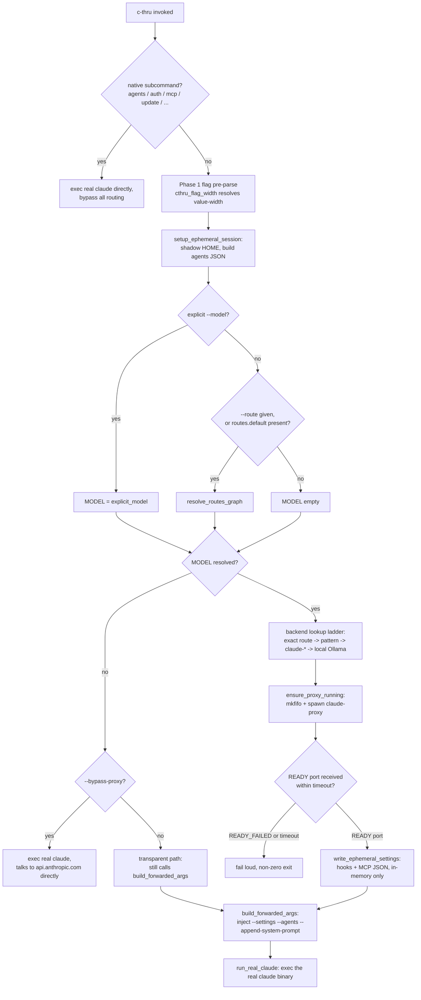
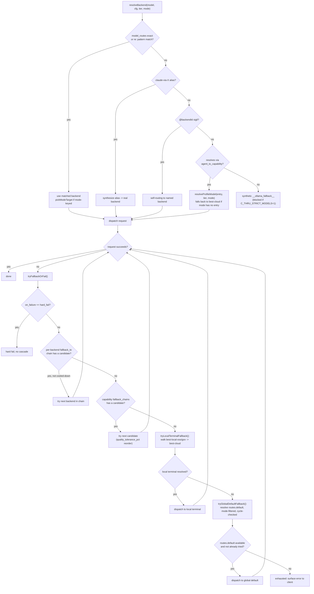
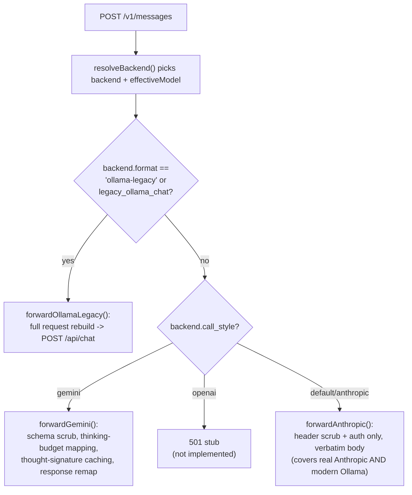
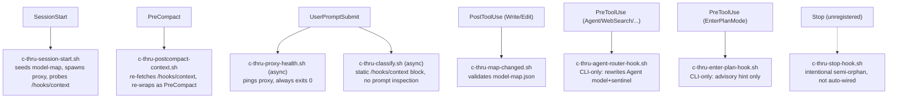
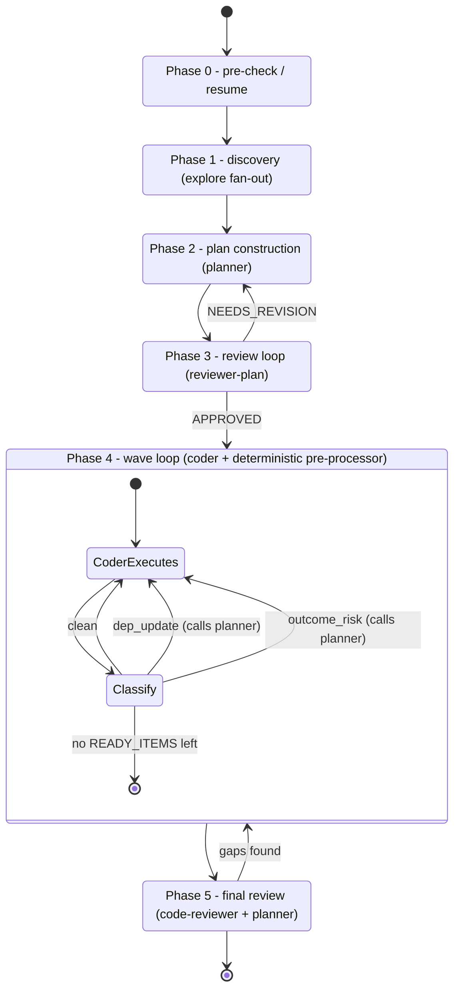
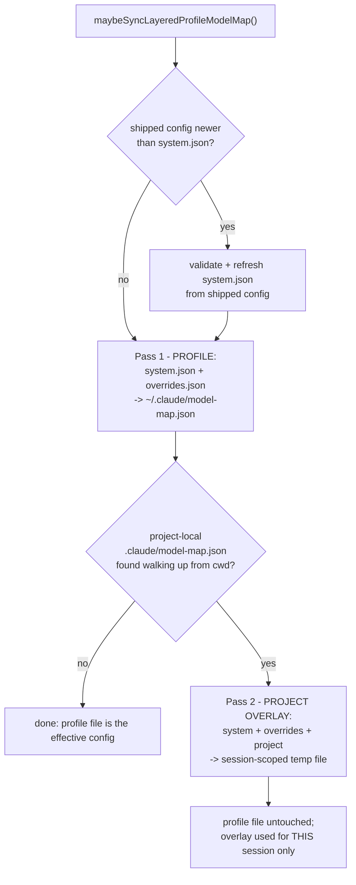
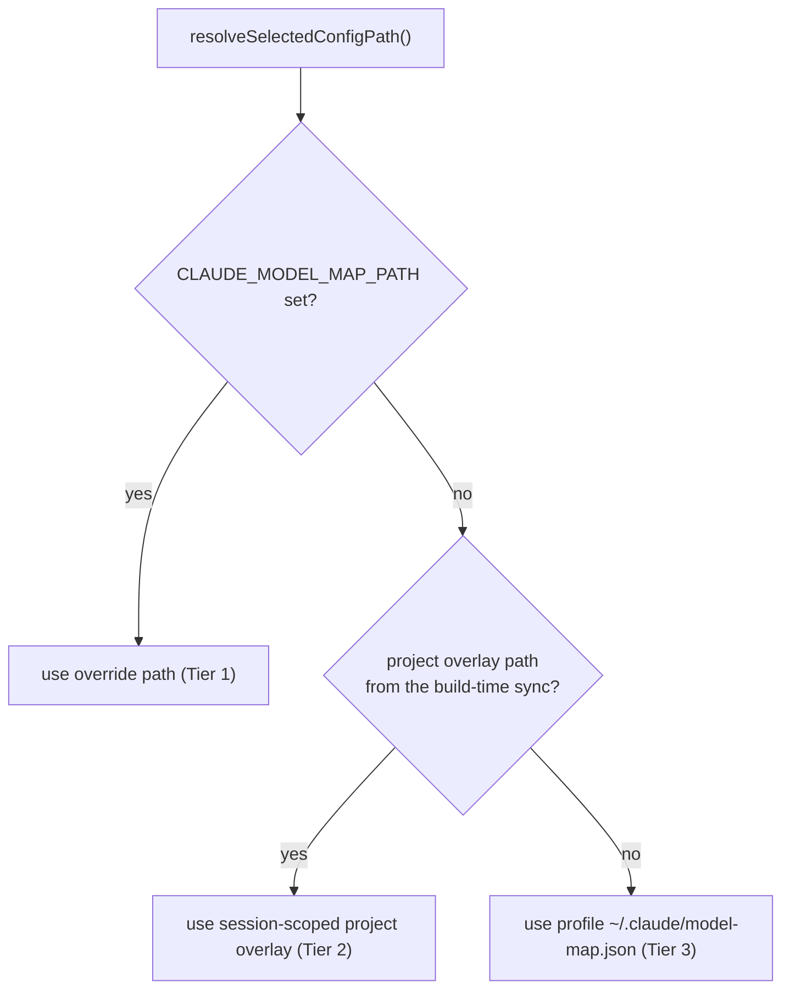

# Architecture diagrams

Visual companion to [functionality-map.md](functionality-map.md) — that doc is the capability
*index*, this doc is the *flow* view for the six sequences most worth seeing end-to-end. Every
diagram has a **Grounding** list of file:line citations immediately below it, verified against
current code at write time. Per functionality-map.md's own convention: treat line numbers as
**approximate anchors, not contracts** — the surrounding function/file names are the durable part.

If you're updating one of these flows, update the diagram in the same commit (see
[`docs/review-methodology.md`](review-methodology.md) rule 9 — doc/code drift after a change is
the default expected outcome unless you actively prevent it).

---

## 1. CLI launch → proxy spawn → claude exec

**Grounding** (`tools/c-thru`, verified against the current file):
- Native-subcommand bypass: `~761-777`, `find_real_claude()` `~738-757`
- Phase 1 flag pre-parse: `~4495-4571`; shared width resolver `cthru_flag_width()` `:3799`
- `setup_ephemeral_session()` `:235`, call site `~4576-4577`
- Model resolution (explicit → route → `routes.default`): `~4585-4609`
- Transparent (no-model) path still routes through `build_forwarded_args`: `~4619-4658`
- Backend lookup ladder: `~4794-4924`
- `ensure_proxy_running()` `:1989` — `mkfifo` `:2024`, FIFO `READY <port>` read (45s default
  timeout) `:2048-2065`, `READY_FAILED`/malformed-line handling `:2053-2062`
- `write_ephemeral_settings()` `:362`
- `build_forwarded_args()` `:3828`
- `run_real_claude()` `:3740`

---

## 2. Model resolution + fallback cascade

**Grounding** (`tools/claude-proxy`):
- `resolveBackend()` `:1117` — priority ladder: model_routes exact/pattern, `claude-via-*`
  alias, `@backend` sigil, capability alias (`resolveCapabilityAlias`,
  `tools/model-map-resolve.js:271-283`) → `resolveProfileModel()` (`model-map-resolve.js:176-190`),
  synthetic `__ollama_fallback__` fallthrough
- `tryFallbackOrFail()` `:1694` — hard-fail gate, per-backend `fallback_to` chain (cooldown/mode-
  filter skip), capability `fallback_chains[tier][cap]` scan (`quality_tolerance_pct` reorder)
- `tryLocalTerminalFallback()` `:1665` — uses `resolveLocalFallback` walking
  best-local-oss/best-local-gov/best-cloud
- `tryGlobalDefaultFallback()` `:1838`
- Bash independently mirrors this same ladder for pre-launch env setup:
  `tools/c-thru:4794-4924` (explicit "same semantics as claude-proxy" comment `~4663`)

---

## 3. Wire translation dispatch (`/v1/messages`)

**Grounding** (`tools/claude-proxy`):
- Dispatch handler entry: `:5044`; sentinel-based per-agent model override before resolution
  `:5103-5151`; dispatch decision `:5265-5284`, mirrored in `dispatchBackend()` `:3753-3761`
- `isOllamaLegacy()` `:852`
- `forwardAnthropic()` `:1900` — no body translation, covers real Anthropic AND non-legacy
  `kind:"ollama"` backends (modern Ollama serves an Anthropic-shaped `/v1/messages`)
- `forwardOllamaLegacy()` `:4244` — `buildOllamaRequestBody`/`flattenMessagesForOllama`
  (`~2138-2158`), POSTs to Ollama-native `/api/chat`
- `forwardGemini()` `:3177` — heaviest translation: `mapAnthropicToGemini` (`~3960`)
- OpenAI `call_style` 501 stub: `~3271-3283`

See also [`docs/anthropic-api-coverage.md`](anthropic-api-coverage.md) for the full per-endpoint
coverage matrix beyond this one dispatch point.

---

## 4. Hook lifecycle

**Grounding** — ephemeral hook registry (single source): `tools/c-thru:384-449`. Parity between
this ephemeral registration and `plugins/c-thru/hooks/hooks.json` (which covers only
SessionStart/UserPromptSubmit×2/PostToolUse/PreCompact — the two PreToolUse hooks are
**CLI-only by design**) is enforced by `test/hooks-declaration-parity.test.js`. `c-thru-stop-hook.sh`
is correctly documented elsewhere (`docs/functionality-map.md` §7) as an intentional
"semi-orphan (symlinked, not auto-registered)" — the dashed arrow above reflects that
deliberately, not a bug.

**Known open item** (tracked separately, not a diagram bug): `c-thru-stop-hook.sh` and
`c-thru-statusline-overlay.sh` both watch `proxy.log` for event tags
(`[fallback.candidate_success]`, `[fallback.chain_start]`) confirmed via git history to be from
an old, since-rewritten fallback architecture (commit `10e88d4`) — neither tag is emitted by the
current `tools/claude-proxy`. Both hooks are wired correctly per this diagram; what they watch
for is stale. See the open task tracking this.

---

## 5. `/c-thru-plan` wave lifecycle

**Grounding** (`skills/c-thru-plan/SKILL.md`, `docs/agent-architecture.md`):
- 6 phases total (0–5), not 5 as sometimes loosely described — Phase 0 pre-check/resume
  (`SKILL.md:21-56`), Phase 2 plan construction (`SKILL.md:116-149`), Phase 3 review loop
  (20-round cap shared with Phase 5, `SKILL.md:151-193`) + aftermath materializing `READY_ITEMS`
  (`SKILL.md:195-208`)
- Phase 4's deterministic pre-processor (classifies each transition `clean`/`dep_update`/
  `outcome_risk`; only the latter two call `planner`) lives in `tools/c-thru-plan-harness.js`,
  not in a prompt — see `docs/agent-architecture.md:89-101`
- Phase 5 final review: `docs/agent-architecture.md:102-103`
- Agent resolution within every phase follows the same 4-layer chain as Flow 2 above
  (`docs/agent-architecture.md:52-65`)

---

## 6. Config layering

Two genuinely different operations, split into two diagrams deliberately — the previous single
paragraph in `docs/model-map.md` conflated them, which produced a real doc bug (see the note
below Flow 6b).

### 6a. Build-time: layered profile sync

**Grounding**: `tools/model-map-config.js:maybeSyncLayeredProfileModelMap()` `:91-172`. Pass 1
`:136` (`profileSyncArgs`, project slot deliberately `''` — "the profile file is shared across
all sessions from all directories... always sync only the persistent layers"). Pass 2 `:151-169`
(`sessionEffectivePath(projectPath)`, only runs when `findParentModelMap(cwd)` finds a project
config). Invoked from `tools/c-thru` via `eval "$(node model-map-config.js --shell-env)"`
(`tools/c-thru:781,816`).

### 6b. Request-time: 3-tier precedence lookup

**Grounding**: `tools/model-map-config.js:resolveSelectedConfigPath()` `:179-202`.

**Doc-accuracy note (fixed alongside these diagrams):** `docs/model-map.md` previously stated
project-local config "is selected as-is... not merged with the profile graph." That's **only**
true of `claude-proxy`'s own cheap SIGHUP-reload path (`resolveConfigSelectionForReload()`,
`tools/claude-proxy:4463-4479` — deliberately re-derives Tier 2 by walking ancestors directly,
skipping the 2-pass sync, for reload speed). On a **normal `c-thru` launch**, Flow 6a's Pass 2
*does* merge system + overrides + project before the proxy ever starts — the two flows above are
genuinely different operations, and the old single-paragraph description picked only one of
them.
